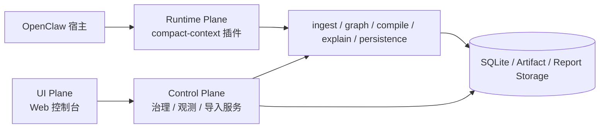

# OpenClaw Context Engine 设计文档 v2

配套实施拆分：
- [context-engine-delivery-plan.zh-CN.md](/d:/C_Project/openclaw_compact_context/docs/planning/context-engine-delivery-plan.zh-CN.md)

## 1. 文档定位

这份文档是当前仓库的统一设计稿，目标是把下面三类信息收敛到一处：

- 产品定位：这个插件到底解决什么问题
- 真实架构：当前代码已经落地了哪些关键设计
- 技术方案：每个功能点后续应该怎么继续做

相较于早期设计稿，v2 明确吸收了两项新的核心结论：

1. 这个项目不是单纯的 `context-engine slot`，而是 `context-engine + hook-aware lifecycle`。
2. 上下文压缩和知识沉淀不是两步，而是一次编译、多个产物。

## 2. 一句话定义

`compact-context` 是一个面向 OpenClaw 的上下文编译引擎：

```text
原始上下文
-> 原子记忆
-> 知识图谱
-> 压缩运行时上下文
-> checkpoint / delta
-> skill candidate
```

它的目标不是“多检索一点文本”，而是：

- 降低长会话 token 成本
- 让规则、流程、约束、状态成为可计算对象
- 让历史上下文在压缩时同步沉淀成结构化记忆
- 让重复稳定的模式长成 skill candidate

## 3. 当前产品边界

当前插件主要处理 3 类对象：

- 运行时上下文
  - 当前目标
  - 当前意图
  - 当前规则/约束
  - 当前流程节点
  - 最近决策与状态变化
- 长期结构化记忆
  - 图谱节点/边
  - checkpoint
  - delta
- 能力沉淀
  - skill candidate

当前不做或尚未做深的部分：

- 复杂的 LLM 抽取器
- 全自动关系发现
- 图可视化
- 多人协作图谱
- transcript 写入前的 tool result 裁剪策略

## 4. 顶层架构

当前推荐把系统理解为下面这条主链路：

```text
OpenClaw transcript / live messages
-> ingest pipeline
-> graph store
-> context compiler
-> prompt compression
-> checkpoint / delta
-> skill crystallizer
```

插件接入形态是：

```text
OpenClaw native plugin
-> registerContextEngine("compact-context")
-> register typed lifecycle hooks
-> SQLite-backed persistence
```

但从阶段 6 开始，顶层部署视角需要进一步明确成三层：

- `Runtime Plane`
  - 也就是当前的 OpenClaw 原生插件
  - 负责 ingest、graph、compile、explain、persistence、promotion 的在线主链
- `Control Plane`
  - 负责人工治理、观测查询、导入任务、审批与运维
  - 不直接替代 runtime 主链，而是通过稳定 contract 调用核心服务
- `UI Plane`
  - 未来的 Web 控制台或管理界面
  - 只调用 control plane，不直接写底层存储

一句话说：

`插件仍然是运行时主链；平台不是替代插件，而是以控制面的方式包住插件主链。`

### 4.1 运行面 / 控制面 / UI 面



这三层的边界是：

- Runtime Plane 负责在线主链和知识写入的权威行为
- Control Plane 负责治理、观测、导入、审批等控制面逻辑
- UI Plane 负责展示和交互，不直接改运行时内部状态

### 4.2 阶段 6 的代码调整原则

阶段 6 的代码调整不应该是“推翻插件架构”，而应该是“在不破坏插件主链的前提下把边界抽出来”。具体原则如下：

1. `不拆掉插件主链`
   - [context-engine.ts](/d:/C_Project/openclaw_compact_context/packages/runtime-core/src/engine/context-engine.ts)
   - [context-compiler.ts](/d:/C_Project/openclaw_compact_context/packages/runtime-core/src/runtime/context-compiler.ts)
   - [ingest-pipeline.ts](/d:/C_Project/openclaw_compact_context/packages/runtime-core/src/runtime/ingest-pipeline.ts)
   仍然是系统权威运行时主链。

2. `先抽服务边界，再考虑界面`
   - governance service
   - observability service
   - import service
   先以 service contract 方式成形，再考虑 Web 页面。

3. `Control Plane 不直接写 SQLite`
   - UI 或控制面服务不应绕开核心服务直接写表
   - correction、approval、import job 都应通过统一 contract 回流主链

4. `目录先分层，不急着拆多包`
   - 优先做单仓库内的目录重构
   - 先把 `runtime / context-processing / governance / control-plane / infrastructure / adapters` 分开
   - 后续若需要，再考虑多包或多应用拆分

也就是说，阶段 6 的重点不是“换架构”，而是：

`把已经长出来的平台能力从插件内部大杂糅状态，收成明确的控制面分层。`

## 5. 核心设计原则

### 5.1 压缩不是摘要，而是编译

压缩的结果不能只是“一段更短的话”，而应该是：

- 对旧历史的结构化投影
- 对当前任务有效状态的最小表达
- 可以继续参与 checkpoint / skill 沉淀的中间表示

### 5.2 压缩和沉淀必须同一步完成

如果压缩之后不更新图谱、checkpoint、skill candidate，就会出现两个问题：

- 下一轮还要重新总结旧历史
- 历史虽然变短了，但知识没有积累

所以必须坚持：

```text
历史压缩
= prompt 裁剪 + 结构化沉淀
```

### 5.3 图谱组织语义，原始文本提供证据

图谱负责回答：

- 什么对象重要
- 当前什么规则生效
- 哪些流程/约束与当前问题相关
- 哪些模式已稳定到可以长成 skill

原始文本负责回答：

- 证据原文是什么
- 来源在哪里
- 细节怎么追溯

### 5.4 Hook 是生命周期协同层

对于 OpenClaw 这种宿主，单靠 context engine 接口是不够的。  
插件必须理解宿主生命周期，尤其是 compaction 相关事件。

## 6. 模块拆分

当前系统建议稳定为 7 个核心模块：

### 6.1 `ingest_pipeline`

职责：

- 接收 transcript、实时消息、规则文档、工具输出
- 标准化为 `RawContextRecord`
- 生成 `Evidence` 节点
- 根据规则生成语义节点与支撑边

### 6.2 `graph_store`

职责：

- 存储节点、边、来源信息
- 提供按 `sessionId / workspaceId / type / text` 的查询
- 同时承载 checkpoint / delta / skill candidate 的持久化

### 6.3 `context_compiler`

职责：

- 从图谱中选出当前最相关的目标、意图、规则、约束、状态、证据、技能候选
- 应用 token budget
- 生成 `RuntimeContextBundle`

### 6.4 `checkpoint_manager`

职责：

- 根据 bundle 生成 checkpoint
- 与上一版 checkpoint 比较，计算 delta

### 6.5 `skill_crystallizer`

职责：

- 从 bundle 中识别稳定模式
- 生成 skill candidate
- 更新候选集合

### 6.6 `context-engine-adapter`

职责：

- 作为 OpenClaw context engine 适配层
- 负责 `bootstrap / ingest / afterTurn / assemble / compact`
- 真正执行 prompt 压缩和消息裁剪

### 6.7 `hook_coordinator`

职责：

- 绑定 OpenClaw typed hooks
- 在 compaction 前后同步图谱与 checkpoint
- 避免宿主侧生命周期与插件内状态失步

## 7. 存储设计

当前主存储方案已经稳定为：

- SQLite
  - 图谱节点
  - 图谱边
  - checkpoint
  - delta
  - skill candidate

优先落在 OpenClaw 的 stateDir 下；若拿不到 stateDir，则回退到本地路径。

### 7.1 为什么继续用 SQLite

原因：

- 本地插件部署最轻
- 结构化查询足够
- 容易做迁移、备份、调试
- 和当前单机/单会话场景匹配

### 7.2 表级职责

- `nodes`
  - 图谱节点
- `edges`
  - 图谱关系

## 7. 运行时上下文边界补充

结合外部参考仓库的实现，可以进一步收敛一条对当前设计很重要的边界：

`compact-context 不负责最终 provider-specific payload，而负责 provider-neutral 的运行时上下文结果。`

配套说明文档：

- [openclaw-runtime-context-strategy.zh-CN.md](/d:/C_Project/openclaw_compact_context/docs/context-processing/openclaw-runtime-context-strategy.zh-CN.md)
- [openclaw-external-context-references.zh-CN.md](/d:/C_Project/openclaw_compact_context/docs/references/openclaw-external-context-references.zh-CN.md)
- [control-plane-service-contracts.zh-CN.md](/d:/C_Project/openclaw_compact_context/docs/control-plane/control-plane-service-contracts.zh-CN.md)

这意味着需要把下面三层区分清楚：

1. `OpenClaw raw context / message window`
   - 宿主原始消息窗口
   - system / developer / project bootstrap 来源
   - tool call / tool result / thinking 等块级消息

2. `compact-context runtime context result`
   - 当前窗口的结构化投影
   - summary blocks
   - diagnostics
   - runtime snapshot

3. `provider payload`
   - 最终 `system / messages / tools`
   - 由 OpenClaw 或宿主 adapter 完成最终组装

这里还要补一个关键判断：

- `transcript` 是恢复源
- `hook` 是源头治理与生命周期协同层
- `assemble()` 才是当前送模前上下文的真相源

也就是说，当前插件最理想的职责是：

```text
OpenClaw raw context
-> compact-context processing
-> provider-neutral runtime context result
-> OpenClaw adapter assembles final provider payload
```

### 7.1 为什么要这样分

原因有三个：

- 避免插件主链跟随不同 provider 的 payload 细节不断漂移
- 让 control plane / debug / observability 可以看见中间结果，而不必反推最终 provider 请求
- 让 runtime snapshot 成为真实送模前状态的权威观察对象

### 7.2 阶段 6 需要补什么

基于这条边界，阶段 6 需要显式补三类 contract：

1. `Runtime Context Window Contract`
   - 当前 raw window
   - 最新 turn 指针
   - toolCall / toolResult pairing
   - 压缩计数

2. `Prompt Assembly Contract`
   - 哪些内容来自上下文处理
   - 哪些内容由宿主最后组装
   - 哪些字段只用于 debug / observability

3. `Runtime Snapshot Persistence`
   - 在 `assemble()` 处保存真正的送模前快照
   - 后续的 inspect/watch/dashboard 优先读快照，而不只读 transcript
- `sources`
  - 来源引用
- `checkpoints`
  - 会话稳定快照
- `deltas`
  - 从上个 checkpoint 以来的增量
- `skill_candidates`
  - 候选技能

## 8. 数据模型

### 8.1 主要节点类型

- `Rule`
- `Constraint`
- `Process`
- `Step`
- `Skill`
- `State`
- `Decision`
- `Outcome`
- `Evidence`
- `Goal`
- `Intent`
- `Tool`
- `Mode`

### 8.2 主要边类型

- `applies_when`
- `requires`
- `forbids`
- `permits`
- `overrides`
- `next_step`
- `uses_skill`
- `supported_by`
- `derived_from`
- `conflicts_with`
- `supersedes`
- `produces`

### 8.3 每条知识的关键元信息

- `scope`
  - `global / workspace / session`
- `kind`
  - `fact / norm / process / state / inference`
- `strength`
  - `hard / soft / heuristic`
- `confidence`
- `sourceRef`
- `version`
- `freshness`
- `validFrom / validTo`

## 9. 功能点与技术方案

下面是每个主要功能点的推荐技术方案。

### 9.1 功能点：OpenClaw 原生插件接入

目标：

- 作为 OpenClaw 原生插件加载
- 不走外部 RPC 主协议

技术方案：

- 使用 `openclaw.plugin.json` 声明插件元信息与 JSON Schema
- 在 `apps/openclaw-plugin/package.json` 通过 `openclaw.extensions` 暴露入口
- 在 `apps/openclaw-plugin/src/index.ts` 与 `packages/openclaw-adapter/src/openclaw/index.ts` 中：
  - `registerContextEngine("compact-context", ...)`
  - 注册 Gateway 调试方法
  - 注册 typed lifecycle hooks

当前实现状态：

- 已完成

### 9.2 功能点：历史 transcript 导入

目标：

- 从 OpenClaw session transcript 恢复当前有效历史

技术方案：

- 读取 JSONL transcript
- 识别 session header
- 识别 entry tree 的 `id / parentId`
- 只重建当前叶子分支
- 支持：
  - `message`
  - `custom_message`
  - `compaction`
- 将不同 entry 映射为 `RawContextRecord`

为什么这样做：

- 避免把旧分支内容误导入当前上下文
- 把 compaction / custom message 也纳入可沉淀记忆

当前实现状态：

- 已完成基础版

后续增强：

- 扩充更多 transcript entry 类型
- 对 tool/use-result 结构做更细粒度映射

### 9.3 功能点：实时消息摄取

目标：

- 每轮消息变化都能进入结构化记忆层

技术方案：

- 在 `ingest()` / `ingestBatch()` / `afterTurn()` 中把消息标准化为 `RawContextRecord`
- 统一映射角色：
  - `user -> Intent`
  - `assistant -> Decision`
  - `tool -> State`
  - `system -> Rule`
- 同时生成：
  - `Evidence` 节点
  - 对应语义节点
  - `supported_by` 边

当前实现状态：

- 已完成基础版

后续增强：

- 加规则抽取器
- 加流程/约束更细的识别策略

### 9.4 功能点：知识图谱持久化

目标：

- 让结构化记忆可查询、可恢复、可解释

技术方案：

- `SqliteGraphStore` 同时实现：
  - `GraphStore`
  - `ContextPersistenceStore`
- 用 JSON 字段保存 payload
- 按 `sessionId / workspaceId` 过滤
- 用稳定 hash 作为语义节点与边的主键，减少重复写入

当前实现状态：

- 已完成

后续增强：

- 增加索引
- 增加迁移版本管理
- 增加更多查询辅助方法

### 9.5 功能点：运行时上下文编译

目标：

- 在预算内输出最小有用上下文

技术方案：

- `ContextCompiler` 从图谱中挑选：
  - `Goal`
  - `Intent`
  - `Rule`
  - `Constraint`
  - `Process / Step`
  - `Decision`
  - `State`
  - `Evidence`
  - `Skill`
- 用轻量打分：
  - scope
  - strength
  - freshness
  - label/payload 与 query 的匹配度
- 按预算裁剪 bundle

当前实现状态：

- 已完成基础版

后续增强：

- 引入更精细的 re-rank
- 利用边关系做多跳扩展
- 对 query 做实体/意图拆分

### 9.6 功能点：Prompt 压缩

目标：

- 真正减少进入模型的消息 token

技术方案：

- 主压缩点放在 `assemble()`，不是 `before_prompt_build`
- 流程如下：

```text
完整消息列表
-> ingest 进图谱
-> compile bundle
-> 判断是否超过 recentRawMessageCount
-> 若超过，只保留最近 raw tail
-> 更早历史改由 bundle 表达
-> systemPromptAddition 注入结构化压缩上下文
```

关键配置：

- `recentRawMessageCount`
  - 最终 prompt 中保留的最近非 system 原始消息数

为什么不把主逻辑放到 `before_prompt_build`：

- `before_prompt_build` 只能注入 prompt 片段
- 不能真正替换会话消息数组
- 不能单独承担“删掉旧历史原文”的职责

当前实现状态：

- 已完成第一版

后续增强：

- 引入“按轮次”而不是“按消息条数”的保留策略
- 给不同角色设置不同保留策略
- 对原始尾部做更智能的预算裁剪

### 9.7 功能点：压缩时同步沉淀知识

目标：

- 避免“压了 prompt，但没沉淀知识”

技术方案：

- 在 `assemble()` 里，如果本轮确实发生了历史压缩：
  - 读取最新 checkpoint
  - 比较当前 bundle 是否有变化
  - 若变化明显，更新 checkpoint
  - 同时更新 skill candidate

为什么这样做：

- 避免每轮都重复写
- 让压缩和记忆演化同步

当前实现状态：

- 已完成基础版

后续增强：

- 把“变化明显”的判定做得更细
- 记录压缩来源范围

### 9.8 功能点：Checkpoint / Delta

目标：

- 保存会话的稳定结构化状态
- 让下一轮不必重新总结整段历史

技术方案：

- checkpoint 记录：
  - 当前 goal / intent
  - active rules
  - active constraints
  - current process
  - recent decisions / states
  - open risks
- delta 记录：
  - 相对于上一 checkpoint 的新增内容

当前实现状态：

- 已完成

后续增强：

- 支持过期 checkpoint 清理
- 支持分层 checkpoint（短期 / 中期 / 长期）

### 9.9 功能点：Hook 生命周期协同

目标：

- 让宿主 compaction 与插件内部状态保持一致

技术方案：

- `before_compaction`
  - 先 ingest 最新 transcript / messages
- `after_compaction`
  - 再次读取 transcript
  - compile bundle
  - create checkpoint
  - crystallize skills
- 使用“最近由本插件发起过 compaction”的 TTL 标记避免重复处理

当前实现状态：

- 已完成

后续增强：

- 加 `session_start / session_end`
- 加 `tool_result_persist`

### 9.10 功能点：Skill Candidate 结晶

目标：

- 把重复出现的稳定模式沉淀为可复用能力

技术方案：

- 输入不是全文，而是 bundle
- 从以下信号组合生成候选：
  - 当前流程节点
  - 规则集合
  - 约束集合
  - 近期决策
  - 证据节点
- 保存：
  - `trigger`
  - `applicableWhen`
  - `requiredRuleIds`
  - `requiredConstraintIds`
  - `workflowSteps`
  - `expectedOutcome`
  - `failureSignals`
  - `evidenceNodeIds`
  - `scores`

当前实现状态：

- 已完成基础版

后续增强：

- 基于多轮统计真正计算频率/稳定性
- 增加 skill candidate 升格阈值

### 9.11 功能点：Explain / Debug

目标：

- 让图谱和压缩结果可审计、可排查

技术方案：

- 暴露 Gateway 调试方法：
  - `health`
  - `compile_context`
  - `query_nodes`
  - `query_edges`
  - `get_latest_checkpoint`
  - `list_checkpoints`
  - `crystallize_skills`
  - `list_skill_candidates`
  - `explain`
- `AuditExplainer` 提供节点来源与关联节点解释

当前实现状态：

- 已完成基础版

后续增强：

- 增加 explain 到 bundle 级别
- 增加“为什么某条消息被裁掉”的解释

### 9.12 功能点：未来的 `tool_result_persist`

目标：

- 在工具结果落 transcript 前控制膨胀

技术方案：

- 在 hook 中识别超大 tool result
- 对安全可裁剪字段做摘要化/截断
- 保留：
  - 关键结果
  - 错误信息
  - 来源与调用标识
- 丢弃：
  - 重复日志
  - 超长冗余输出
  - 可从文件/外部存储回看的大块内容

为什么优先级高：

- 它能减少未来的 transcript 体积
- 对长会话 token 控制价值很大

当前实现状态：

- 还未接入

## 10. 为什么 `before_prompt_build` 不是主压缩点

这个点需要单独强调。

`before_prompt_build` 当然有价值，但它更适合做：

- 小规模补充上下文
- 附加静态规则
- 插入 cache-friendly system context

它不适合做主压缩器，原因是：

- 它不能真正替换原始消息数组
- 很容易和 `assemble()` 重复注入上下文
- 容易让 token 看起来被“优化了”，但实际上旧消息还在

因此当前推荐策略是：

1. `assemble()` 负责真正删减原始历史
2. `before_compaction / after_compaction` 负责生命周期同步
3. `before_prompt_build` 只在将来需要时做辅助注入

## 11. 当前实现与文档映射

主要代码位置如下：

- 插件入口
  - [index.ts](/d:/C_Project/openclaw_compact_context/apps/openclaw-plugin/src/index.ts)
- OpenClaw 适配层
  - [context-engine-adapter.ts](/d:/C_Project/openclaw_compact_context/packages/openclaw-adapter/src/openclaw/context-engine-adapter.ts)
- Hook 协调
  - [hook-coordinator.ts](/d:/C_Project/openclaw_compact_context/packages/openclaw-adapter/src/openclaw/hook-coordinator.ts)
- transcript 导入
  - [transcript-loader.ts](/d:/C_Project/openclaw_compact_context/packages/openclaw-adapter/src/openclaw/transcript-loader.ts)
- 核心引擎
  - [context-engine.ts](/d:/C_Project/openclaw_compact_context/packages/runtime-core/src/engine/context-engine.ts)
- 图谱摄取
  - [ingest-pipeline.ts](/d:/C_Project/openclaw_compact_context/packages/runtime-core/src/runtime/ingest-pipeline.ts)
- 上下文编译
  - [context-compiler.ts](/d:/C_Project/openclaw_compact_context/packages/runtime-core/src/runtime/context-compiler.ts)
- checkpoint
  - [checkpoint-manager.ts](/d:/C_Project/openclaw_compact_context/packages/runtime-core/src/runtime/checkpoint-manager.ts)
- skill candidate
  - [skill-crystallizer.ts](/d:/C_Project/openclaw_compact_context/packages/runtime-core/src/runtime/skill-crystallizer.ts)
- SQLite
  - [sqlite-graph-store.ts](/d:/C_Project/openclaw_compact_context/packages/runtime-core/src/infrastructure/sqlite-graph-store.ts)

## 12. 近期路线图

建议按这个顺序继续推进：

### P1

- 做 `tool_result_persist`
- 把超大 tool result 的 transcript 策略定下来
- 优化 `assemble()` 的 prefix compression

### P2

- 更细粒度的规则/约束/流程抽取
- 更好的 skill 候选评分
- 更丰富的 explain 输出

### P3

- 图谱可视化
- 多 workspace / global 联动策略
- 更高级的关系扩展检索

## 13. 结论

现在这套设计已经可以明确地说：

它不是“给 prompt 拼点摘要”的插件，  
而是一个把会话上下文编译成结构化记忆、压缩运行上下文、并持续沉淀能力模式的引擎。

当前最重要的技术判断是：

- 真正的 prompt 压缩在 `assemble()`
- 真正的生命周期同步靠 hooks
- 真正的长期价值来自 graph / checkpoint / skill candidate 的一体化沉淀


