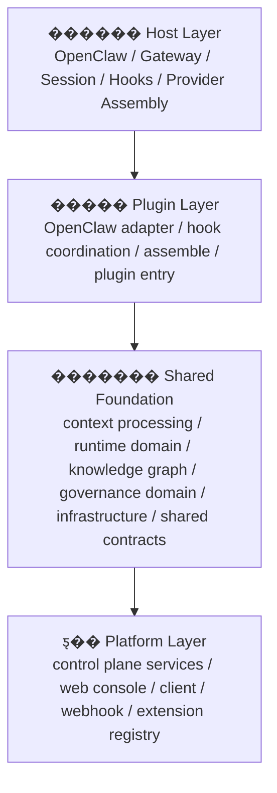

# ��ǰϵͳ�ֲ���߽�

����ĵ�ר�Żش� 3 �����⣺

1. �������ڵ����Dz��ǡ���� + ƽ̨��
2. �����ƽ̨����������ֱ���ʲô
3. ������Щ���Ѿ�ʵ�֣���Щ��û��ȫʵ��

����ĵ���

- ����Ƹ壺[context-engine-design-v2.zh-CN.md](/d:/C_Project/openclaw_compact_context/docs/architecture/context-engine-design-v2.zh-CN.md)
- ����ʱ�����IJ��ԣ�[openclaw-runtime-context-strategy.zh-CN.md](/d:/C_Project/openclaw_compact_context/docs/context-processing/openclaw-runtime-context-strategy.zh-CN.md)
- ��� API contract��[plugin-api-contract.zh-CN.md](/d:/C_Project/openclaw_compact_context/docs/architecture/plugin-api-contract.zh-CN.md)
- �׶� 6 ƽ̨��������[stage-6-platformization-plan.zh-CN.md](/d:/C_Project/openclaw_compact_context/docs/stages/stage-6-platformization-plan.zh-CN.md)

## 1. һ�仰����

�Ӳ�Ʒ��̬�����������ڿ��Ը����ɣ�

`��� + ƽ̨`

�������������ܹ�������׼ȷ��˵���ǣ�

`���� + ��� + ������� + ƽ̨`

Ҳ����˵��

- `����`
  - OpenClaw �Լ�
- `���`
  - Runtime Plane
- `�������`
  - �����ƽ̨��ͬ�����ĺ��IJ�
- `ƽ̨`
  - Control Plane + UI + Ecosystem

## 2. ��ǰ�����ֲ�ͼ



## 3. �Ŀ�ֱ���ʲô

### 3.1 ����

������ OpenClaw ��������������Dzֿ��ڲ��ĺ���ʵ�֡�

������

- �ṩ session / transcript / hook ��������
- ����� `bootstrap / ingest / afterTurn / assemble`
- ����ͬ provider ��װ���� `system / messages / tools`

�ؼ�ԭ��

`���� provider payload ��װ��Ȼ����������������������`

### 3.2 ���

������������� OpenClaw ���������ʱ�����Dz㡣

������

- ������ԭʼ��Ϣ�� hook �¼�
- ���������Ĵ����֪ʶͼ������
- �� `assemble()` ʱ�γɵ�ǰ�ֽ��
- �ظ�������
  - `messages`
  - `systemPromptAddition`

���ʹ���λ�ã�

- [packages/openclaw-adapter/src/openclaw](/d:/C_Project/openclaw_compact_context/packages/openclaw-adapter/src/openclaw)
- [packages/openclaw-adapter/src/plugin](/d:/C_Project/openclaw_compact_context/packages/openclaw-adapter/src/plugin)
- [apps/openclaw-plugin/src](/d:/C_Project/openclaw_compact_context/apps/openclaw-plugin/src)

����˵����

- [index.ts](/d:/C_Project/openclaw_compact_context/packages/openclaw-adapter/src/index.ts)
  ������Ҫ��Ϊ������ۺ���ڣ�������Ѿ������� `packages/openclaw-adapter/src/openclaw`��`packages/openclaw-adapter/src/plugin` �� `apps/openclaw-plugin/src`��

### 3.3 �������

�����������ƽ̨��̨��Ҳ���Dz��˽��ʵ�֡�

���ǣ�

`�����ƽ̨��ͬ������һ���ڲ����IJ㡣`

����Ҫ���� 5 �ණ����

- `context processing`
  - runtime window
  - parsing / normalization
  - summary / prompt assembly
  - runtime snapshot model
- `runtime domain`
  - ingest / compiler / explainer / checkpoint / experience
- `knowledge`
  - graph / provenance / checkpoint / delta / skill / recall
- `governance domain`
  - authority / scope / lifecycle / corrections �ĵײ����
- `infrastructure`
  - graph store
  - sqlite persistence
  - artifact store
  - snapshot persistence

��Ӧ��ǰĿ¼��Ҫ�ǣ�

- [packages/runtime-core/src/context-processing](/d:/C_Project/openclaw_compact_context/packages/runtime-core/src/context-processing)
- [packages/runtime-core/src/runtime](/d:/C_Project/openclaw_compact_context/packages/runtime-core/src/runtime)
- [packages/runtime-core/src/governance](/d:/C_Project/openclaw_compact_context/packages/runtime-core/src/governance)
- [packages/runtime-core/src/infrastructure](/d:/C_Project/openclaw_compact_context/packages/runtime-core/src/infrastructure)
- [packages/contracts/src/types](/d:/C_Project/openclaw_compact_context/packages/contracts/src/types)

����˵����

- `src/context-processing/*`
- `src/runtime/*`
- `src/governance/*`
- `src/infrastructure/*`
  �⼸�� compat ·���Ѿ�ɾ������ǰΨһ��Դ�Ѿ������� `packages/runtime-core/src/*`��

### 3.4 ƽ̨

ƽ̨���� Control Plane + UI Plane + ������̬�㡣

������

- governance
- observability
- import
- facade / server / console
- extension registry
- workspace catalog
- webhook / platform event
- external client

��Ӧ������Ҫ�ǣ�

- [packages/compact-context-core/src](/d:/C_Project/openclaw_compact_context/packages/compact-context-core/src)
- [packages/control-plane-shell/src](/d:/C_Project/openclaw_compact_context/packages/control-plane-shell/src)
- [apps/control-plane/src](/d:/C_Project/openclaw_compact_context/apps/control-plane/src)

����˵����

- [openclaw-context-plugin.ts](/d:/C_Project/openclaw_compact_context/apps/openclaw-plugin/src/bin/openclaw-context-plugin.ts)
- [openclaw-control-plane.ts](/d:/C_Project/openclaw_compact_context/apps/control-plane/src/bin/openclaw-control-plane.ts)
  ��ǰ��ʵ���Ѿ��̶��� package/app ����Դ�룬�������� root `src` compat��

## 4. ������ʩ�㵽����ʲô

���������׻�����һ�㣬���Ե������͡�

������ʩ��ָ�IJ��ǡ�ҵ���߼��������ǣ�

`�桢ȡ���־û���������������չ�����Щ����������`

�����ĵ��ǣ�

- ������ô��
- �浽����
- ��ô��ȡ
- ��ô���־û��ͻط�

����ֱ�ӹ��ģ�

- �᰸�ò���ͨ��
- ij��֪ʶ�Dz��� Goal
- ij�����������Dz��Ǹ߷���

��ǰ����͵Ļ�����ʩʵ���ǣ�

- [context-persistence.ts](/d:/C_Project/openclaw_compact_context/packages/runtime-core/src/infrastructure/context-persistence.ts)
- [graph-store.ts](/d:/C_Project/openclaw_compact_context/packages/runtime-core/src/infrastructure/graph-store.ts)
- [sqlite-graph-store.ts](/d:/C_Project/openclaw_compact_context/packages/runtime-core/src/infrastructure/sqlite-graph-store.ts)
- [tool-result-artifact-store.ts](/d:/C_Project/openclaw_compact_context/packages/openclaw-adapter/src/openclaw/tool-result-artifact-store.ts)
- [index.ts](/d:/C_Project/openclaw_compact_context/packages/runtime-core/src/infrastructure/index.ts)

һ�仰���֣�

- `֪ʶ��`����������ʲô��Ϊʲô�桱
- `������ʩ��`����������ô�桢�浽�ġ���ôȡ��

## 5. �����Ѿ�ʵ����ʲô

### 5.1 �����

�Ѿ�ʵ�֣�

- OpenClaw plugin entry
- hook coordination
- ingest / afterTurn / assemble
- runtime window / prompt assembly / runtime snapshot
- `messages + systemPromptAddition` �ؽ�����

Ҳ����˵��

`��������Ѿ�ͨ�ˡ�`

### 5.2 �������

�Ѿ�ʵ�֣�

- context processing contracts
- runtime context window contract
- prompt assembly contract
- graph / checkpoint / delta / skill
- sqlite persistence
- artifact store
- governance domain rules

����û��ȫ������ǣ�

- `apps/*` / `packages/*` ��Ȼ��Ҫ���� workspace-first ���壬��δ���׳�Ϊ����������Ԫ
- һ���ֹ��������Ȼͨ�� root workspace ͳһ����
- Ŀǰ�տڽ�չ��õ��� `packages/contracts`�����Ѿ������ȶ�ֻ��¶���� `contracts + types` ����

Ҳ����˵��

`�߼��߽��Ѿ���ס������Ŀ¼��һ��Ǩ��Ҳ����ɣ������������߽绹û��ȫ�տڡ�`

### 5.3 ƽ̨��

�Ѿ�ʵ�֣�

- governance service
- observability service
- import service
- control-plane facade
- server / console
- extension registry
- workspace catalog
- platform events / webhook
- external client

Ҳ����˵��

`ƽ̨�������Ѿ���ɣ���ֻ���ĵ���`

### 5.4 ʣ�� `src` �ij��ڹ���

��ǰ����Ŀ�겻�ǡ������� `src` ��ա������ǣ�

`ֻ�����г��ڼ�ֵ�� repo �ڲ�Դ�룬���������� compat ת���㡣`

���� `src` ���ʣ�������Ѿ���ȷ�ֳ����ࣺ

- `���ڱ���� repo �ڲ�Դ��`
  - [tests](/d:/C_Project/openclaw_compact_context/tests)
- `�����۵� compat`
  - root `src` �µ� compat ������
  - ��ǰ��ʽ���λ�� [packages/runtime-core/src/engine/context-engine.ts](/d:/C_Project/openclaw_compact_context/packages/runtime-core/src/engine/context-engine.ts)
  - [index.ts](/d:/C_Project/openclaw_compact_context/packages/openclaw-adapter/src/index.ts)
  - [openclaw-context-plugin.ts](/d:/C_Project/openclaw_compact_context/apps/openclaw-plugin/src/bin/openclaw-context-plugin.ts)
  - [openclaw-control-plane.ts](/d:/C_Project/openclaw_compact_context/apps/control-plane/src/bin/openclaw-control-plane.ts)

��Ӧ�嵥�ͱ߽�˵������

- [src-ownership-boundary.zh-CN.md](/d:/C_Project/openclaw_compact_context/docs/planning/src-ownership-boundary.zh-CN.md)
- [src-compat-inventory.zh-CN.md](/d:/C_Project/openclaw_compact_context/docs/planning/src-compat-inventory.zh-CN.md)

## 6. ��ǰ�������������

�������ҵĵط����ǡ�û�зֲ㡱�����ǣ�

`�ֲ�����Ѿ����ˣ�����������߽绹û���׶��֡�`

����͵� 4 �������ǣ�

1. �����ֱ�� import ƽ̨����ʵ��  
   ��������Ѿ�ͨ�� facade contract + bridge �𱡣��������װ��߽����м����ս�ռ䡣

2. ƽ̨ contract ���������������  
   ��������Ѿ���ʼ���������� runtime context contract �������� [runtime-context.ts](/d:/C_Project/openclaw_compact_context/packages/contracts/src/types/runtime-context.ts)��

3. control-plane server �� runtime read-model �ı߽���Ȼ��ͬ��Э������������ȫ��������Э�顣

4. `apps/*` �� `packages/*` ���� workspace-first �ṹ  
   �߼����Ѿ��ܶ��� build/check/pack�����������ࡢ�汾���ԺͲ�����̬��û��ȫ������

## 7. ������һ��Ҫȥ�Ľṹ

Ŀ�겻���ټ���������� + ƽ̨����������ô���߽������ս�ɣ�

### 7.1 ���

- ֻ���� plugin shell
- ֻ���� OpenClaw adapter / hooks / assemble Э��

### 7.2 �������

- ���� contracts
- shared runtime core
- shared knowledge / governance / infrastructure

### 7.3 ƽ̨

- control-plane services
- server / console / client / ecosystem

## 8. �����������Ŀ

�Ƽ��������������� Git �ֿ⣬�����Ȳ�ɵ��ֿ����Ŀ��

```text
apps/
  openclaw-plugin/
  control-plane/
  web-console/

packages/
  contracts/
  runtime-core/
  compact-context-core/
  openclaw-adapter/
  sdk/
```

������ؼ���һ���ǣ�

`�������ֻ����һ�ݣ����Dz��һ�ݡ�ƽ̨һ�ݡ�`

## 9. һ�仰����

`���������Ѿ����ǵ�������� + ƽ̨�����飬���ǡ����� + ��� + ������� + ƽ̨���Ľṹ��������û����ģ��ǰ�����߼��ֲ㳹�׶��ֳ������Ĵ���߽硣`


