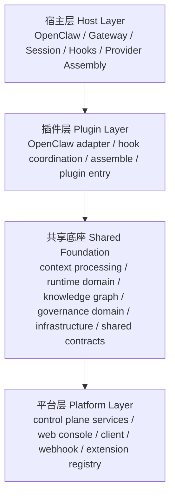

# 当前系统分层与边界

这份文档专门回答 3 个问题：

1. 我们现在到底是不是“插件 + 平台”
2. 插件、平台、共享底座分别是什么
3. 还有哪些层已经实现，哪些还没完全实现

相关文档：

- 总设计稿：[context-engine-design-v2.zh-CN.md](/d:/C_Project/openclaw_compact_context/docs/architecture/context-engine-design-v2.zh-CN.md)
- 运行时上下文策略：[openclaw-runtime-context-strategy.zh-CN.md](/d:/C_Project/openclaw_compact_context/docs/context-processing/openclaw-runtime-context-strategy.zh-CN.md)
- 插件 API contract：[plugin-api-contract.zh-CN.md](/d:/C_Project/openclaw_compact_context/docs/architecture/plugin-api-contract.zh-CN.md)
- 阶段 6 平台化方案：[stage-6-platformization-plan.zh-CN.md](/d:/C_Project/openclaw_compact_context/docs/stages/stage-6-platformization-plan.zh-CN.md)

## 1. 一句话结论

从产品形态看，我们现在可以概括成：

`插件 + 平台`

但从完整技术架构看，更准确的说法是：

`宿主 + 插件 + 共享底座 + 平台`

也就是说：

- `宿主`
  - OpenClaw 自己
- `插件`
  - Runtime Plane
- `共享底座`
  - 插件和平台共同依赖的核心层
- `平台`
  - Control Plane + UI + Ecosystem

## 2. 当前完整分层图



## 3. 四块分别是什么

### 3.1 宿主

宿主是 OpenClaw 本身，不属于我们仓库内部的核心实现。

它负责：

- 提供 session / transcript / hook 生命周期
- 调用插件的 `bootstrap / ingest / afterTurn / assemble`
- 按不同 provider 组装最终 `system / messages / tools`

关键原则：

`最终 provider payload 组装仍然是宿主做，不是我们做。`

### 3.2 插件

插件就是运行在 OpenClaw 里面的运行时主链壳层。

它负责：

- 接宿主原始消息与 hook 事件
- 调用上下文处理和知识图谱能力
- 在 `assemble()` 时形成当前轮结果
- 回给宿主：
  - `messages`
  - `systemPromptAddition`

典型代码位置：

- [packages/openclaw-adapter/src/openclaw](/d:/C_Project/openclaw_compact_context/packages/openclaw-adapter/src/openclaw)
- [packages/openclaw-adapter/src/plugin](/d:/C_Project/openclaw_compact_context/packages/openclaw-adapter/src/plugin)
- [apps/openclaw-plugin/src](/d:/C_Project/openclaw_compact_context/apps/openclaw-plugin/src)

补充说明：

- [src/adapters/index.ts](/d:/C_Project/openclaw_compact_context/src/adapters/index.ts)
  现在主要保留为兼容别名层，主入口已经收敛到 `packages/openclaw-adapter/src/openclaw` 和 `apps/openclaw-plugin/src`。

### 3.3 共享底座

共享底座不是平台后台，也不是插件私有实现。

它是：

`插件和平台共同依赖的一份内部核心层。`

它主要包括 5 类东西：

- `context processing`
  - runtime window
  - parsing / normalization
  - summary / prompt assembly
  - runtime snapshot model
- `runtime domain`
  - ingest / compiler / explainer / checkpoint / experience
- `knowledge`
  - graph / provenance / checkpoint / delta / skill / recall
- `governance domain`
  - authority / scope / lifecycle / corrections 的底层规则
- `infrastructure`
  - graph store
  - sqlite persistence
  - artifact store
  - snapshot persistence

对应当前目录主要是：

- [packages/runtime-core/src/context-processing](/d:/C_Project/openclaw_compact_context/packages/runtime-core/src/context-processing)
- [packages/runtime-core/src/runtime](/d:/C_Project/openclaw_compact_context/packages/runtime-core/src/runtime)
- [packages/runtime-core/src/governance](/d:/C_Project/openclaw_compact_context/packages/runtime-core/src/governance)
- [packages/runtime-core/src/infrastructure](/d:/C_Project/openclaw_compact_context/packages/runtime-core/src/infrastructure)
- [src/types](/d:/C_Project/openclaw_compact_context/src/types)

补充说明：

- `src/context-processing/*`
- `src/runtime/*`
- `src/governance/*`
- `src/infrastructure/*`
  这几组 compat 路径已经删除，当前唯一真源已经收敛到 `packages/runtime-core/src/*`。

### 3.4 平台

平台就是 Control Plane + UI Plane + 开放生态层。

它负责：

- governance
- observability
- import
- facade / server / console
- extension registry
- workspace catalog
- webhook / platform event
- external client

对应代码主要是：

- [packages/control-plane-core/src](/d:/C_Project/openclaw_compact_context/packages/control-plane-core/src)
- [packages/control-plane-shell/src](/d:/C_Project/openclaw_compact_context/packages/control-plane-shell/src)
- [apps/control-plane/src](/d:/C_Project/openclaw_compact_context/apps/control-plane/src)

补充说明：

- [src/control-plane](/d:/C_Project/openclaw_compact_context/src/control-plane)
- [src/bin](/d:/C_Project/openclaw_compact_context/src/bin)
  这两组路径现在主要保留为 compat 转发层，主实现已经迁到 package/app 本地源码。

## 4. 基础设施层到底是什么

这是最容易混淆的一层，所以单独解释。

基础设施层指的不是“业务逻辑”，而是：

`存、取、持久化、工件管理、快照管理这些底座能力。`

它关心的是：

- 数据怎么存
- 存到哪里
- 怎么读取
- 怎么做持久化和回放

而不直接关心：

- 提案该不该通过
- 某条知识是不是 Goal
- 某个导入任务是不是高风险

当前最典型的基础设施实现是：

- [context-persistence.ts](/d:/C_Project/openclaw_compact_context/packages/runtime-core/src/infrastructure/context-persistence.ts)
- [graph-store.ts](/d:/C_Project/openclaw_compact_context/packages/runtime-core/src/infrastructure/graph-store.ts)
- [sqlite-graph-store.ts](/d:/C_Project/openclaw_compact_context/packages/runtime-core/src/infrastructure/sqlite-graph-store.ts)
- [tool-result-artifact-store.ts](/d:/C_Project/openclaw_compact_context/src/openclaw/tool-result-artifact-store.ts)
- [index.ts](/d:/C_Project/openclaw_compact_context/packages/runtime-core/src/infrastructure/index.ts)

一句话区分：

- `知识层`：决定“存什么、为什么存”
- `基础设施层`：决定“怎么存、存到哪、怎么取”

## 5. 现在已经实现了什么

### 5.1 插件侧

已经实现：

- OpenClaw plugin entry
- hook coordination
- ingest / afterTurn / assemble
- runtime window / prompt assembly / runtime snapshot
- `messages + systemPromptAddition` 回交宿主

也就是说：

`插件主链已经通了。`

### 5.2 共享底座

已经实现：

- context processing contracts
- runtime context window contract
- prompt assembly contract
- graph / checkpoint / delta / skill
- sqlite persistence
- artifact store
- governance domain rules

但还没完全做完的是：

- `apps/*` / `packages/*` 仍然主要承载 workspace-first 语义，尚未彻底成为独立发布单元
- 一部分公共入口仍然通过 root workspace 统一编排
- 目前收口进展最好的是 `packages/contracts`，它已经可以稳定只暴露共享 `contracts + types` 表面

也就是说：

`逻辑边界已经立住，物理目录第一轮迁移也已完成，但独立发布边界还没完全收口。`

### 5.3 平台侧

已经实现：

- governance service
- observability service
- import service
- control-plane facade
- server / console
- extension registry
- workspace catalog
- platform events / webhook
- external client

也就是说：

`平台基础版已经完成，不只是文档。`

### 5.4 剩余 `src` 的长期归属

当前后续目标不是“把整个 `src` 清空”，而是：

`只保留有长期价值的 repo 内部源码，并持续收缩 compat 转发层。`

现在 `src` 里的剩余内容已经明确分成两类：

- `长期保留的 repo 内部源码`
  - [src/types](/d:/C_Project/openclaw_compact_context/src/types)
  - [src/contracts](/d:/C_Project/openclaw_compact_context/src/contracts)
  - [src/evaluation](/d:/C_Project/openclaw_compact_context/src/evaluation)
  - [src/tests](/d:/C_Project/openclaw_compact_context/src/tests)
- `迁移窗口 compat 转发层`
  - [src/index.ts](/d:/C_Project/openclaw_compact_context/src/index.ts)
  - [src/openclaw](/d:/C_Project/openclaw_compact_context/src/openclaw)
  - [src/plugin](/d:/C_Project/openclaw_compact_context/src/plugin)
  - [src/control-plane](/d:/C_Project/openclaw_compact_context/src/control-plane)
  - [src/control-plane-core](/d:/C_Project/openclaw_compact_context/src/control-plane-core)
  - [src/engine](/d:/C_Project/openclaw_compact_context/src/engine)
  - [src/adapters/index.ts](/d:/C_Project/openclaw_compact_context/src/adapters/index.ts)
  - [src/bin](/d:/C_Project/openclaw_compact_context/src/bin)

对应清单和边界说明见：

- [src-ownership-boundary.zh-CN.md](/d:/C_Project/openclaw_compact_context/docs/planning/src-ownership-boundary.zh-CN.md)
- [src-compat-inventory.zh-CN.md](/d:/C_Project/openclaw_compact_context/docs/planning/src-compat-inventory.zh-CN.md)

## 6. 当前真正的耦合问题

现在最乱的地方不是“没有分层”，而是：

`分层概念已经有了，但代码物理边界还没彻底兑现。`

最典型的 4 个问题是：

1. 插件侧直接 import 平台服务实现  
   这个问题已经通过 facade contract + bridge 拆薄，但插件侧装配边界仍有继续收紧空间。

2. 平台 contract 反向依赖插件类型  
   这个问题已经开始修正：共享 runtime context contract 已从插件类型层抽出到 [runtime-context.ts](/d:/C_Project/openclaw_compact_context/src/types/runtime-context.ts)。

3. control-plane server 与 runtime read-model 的边界仍然是同仓协作，而不是完全独立部署协议。

4. `apps/*` 和 `packages/*` 还是 workspace-first 结构  
   逻辑上已经能独立 build/check/pack，但发布节奏、版本策略和部署形态还没完全独立。

## 7. 我们下一步要去的结构

目标不是再继续讲“插件 + 平台”概念，而是让代码边界真正收紧成：

### 7.1 插件

- 只保留 plugin shell
- 只保留 OpenClaw adapter / hooks / assemble 协调

### 7.2 共享底座

- 共享 contracts
- shared runtime core
- shared knowledge / governance / infrastructure

### 7.3 平台

- control-plane services
- server / console / client / ecosystem

## 8. 如果后面拆多项目

推荐方向不是立即拆多个 Git 仓库，而是先拆成单仓库多项目：

```text
apps/
  openclaw-plugin/
  control-plane/
  web-console/

packages/
  contracts/
  runtime-core/
  control-plane-core/
  openclaw-adapter/
  sdk/
```

其中最关键的一点是：

`共享底座只保留一份，不是插件一份、平台一份。`

## 9. 一句话结论

`我们现在已经不是单纯“插件 + 平台”两块，而是“宿主 + 插件 + 共享底座 + 平台”的结构；真正还没做完的，是把这个逻辑分层彻底兑现成清晰的代码边界。`


