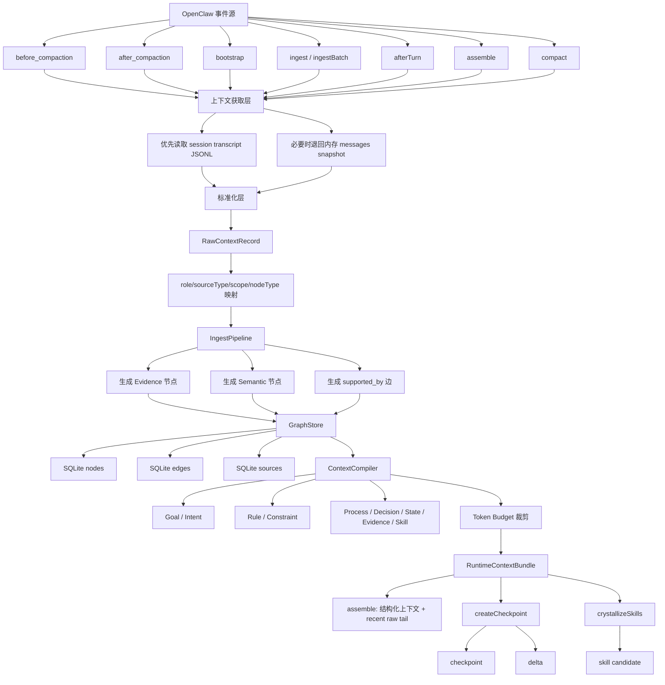
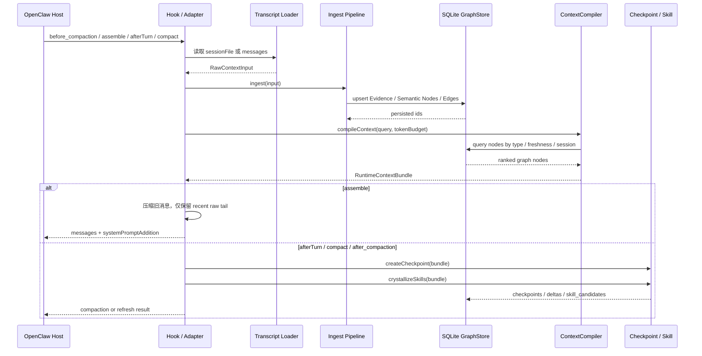

# 从 Hook 到图谱：上下文获取、压缩与沉淀全流程

## 1. 文档目标

这份文档描述 `compact-context` 在当前仓库中的完整主链路：

```text
OpenClaw Hook / Context Engine 生命周期
-> 获取上下文
-> 标准化为 RawContextRecord
-> 原子化为 Evidence / Semantic Node
-> 写入 SQLite 图谱
-> 编译 RuntimeContextBundle
-> 压缩 prompt
-> 生成 checkpoint / delta / skill candidate
```

重点回答三个问题：

1. hook 是怎么触发并拿到上下文的
2. 上下文是怎么一步步变成图谱的
3. 每个阶段有哪些可选实现方式，当前仓库采用了哪一种

---

## 2. 总体流程图



---

## 3. 触发入口矩阵

| 入口 | 触发时机 | 主要职责 | 当前状态 |
| --- | --- | --- | --- |
| `bootstrap()` | session 初次接入 | 从 transcript 恢复历史有效分支并导入 | 已实现 |
| `ingest()` | 单条消息进入 | 把单条消息写入图谱 | 已实现 |
| `ingestBatch()` | 批量消息进入 | 批量标准化并入图 | 已实现 |
| `afterTurn()` | 一轮交互结束 | ingest 新增消息，compile，checkpoint，skill crystallize | 已实现 |
| `assemble()` | 构造 prompt 前 | ingest 全量消息，compile，上下文压缩，保留最近 raw tail | 已实现 |
| `compact()` | 宿主触发压缩 | compile + checkpoint + skill crystallize，形成压缩结果 | 已实现 |
| `before_compaction` | 宿主压缩前 | 先把最新 transcript / snapshot 同步进图谱 | 已实现 |
| `after_compaction` | 宿主压缩后 | 重读压缩后 transcript，刷新 checkpoint 和 skill candidates | 已实现 |
| `tool_result_persist` | 工具结果落 transcript 前 | 对超长工具输出预裁剪和摘要化 | 已实现，进入收尾增强阶段 |
| `before_prompt_build` | prompt 拼装前 | 辅助注入静态上下文 | 刻意未接为主链 |

---

## 4. 端到端时序图



---

## 5. 分阶段流程与实现方式

## 5.1 触发层

### 目标

把宿主生命周期事件转成统一的“上下文同步与沉淀动作”。

### 当前实现

- `context-engine` 生命周期方法：
  - `bootstrap`
  - `ingest`
  - `ingestBatch`
  - `afterTurn`
  - `assemble`
  - `compact`
- OpenClaw typed hooks：
  - `before_compaction`
  - `after_compaction`

### 当前代码位置

- `packages/openclaw-adapter/src/openclaw/context-engine-adapter.ts`
- `packages/openclaw-adapter/src/openclaw/hook-coordinator.ts`
- `apps/openclaw-plugin/src/index.ts`

### 可选实现方式

#### 方式 A：只接 `context-engine` 生命周期

优点：

- 简单
- 实现面小

缺点：

- 宿主在生命周期外做的 compaction 或 transcript 变更可能感知不到

适用：

- 只做轻量 prompt 补充，不做持久化图谱

#### 方式 B：`context-engine` + typed hooks 协同

优点：

- 能跟住宿主 compaction 生命周期
- 图谱、checkpoint、prompt 压缩状态更一致

缺点：

- 生命周期更多，需要做好去重和幂等

适用：

- 当前仓库的主路线

#### 方式 C：额外接 `tool_result_persist`

优点：

- 在写 transcript 前就控制超长工具输出
- 能从源头减少后续上下文膨胀

缺点：

- 需要非常谨慎地定义“哪些字段可裁剪”

适用：

- 当前仓库已接入，后续重点是 explain 与 artifact 收尾

### 推荐结论

当前仓库应继续采用 `方式 B`，并把 `方式 C` 作为下一阶段增强。

---

## 5.2 上下文获取层

### 目标

从宿主拿到“当前有效上下文”，而不是盲目平铺全部历史。

### 当前实现

优先级如下：

1. 如果拿得到 `sessionFile`，优先读取 OpenClaw JSONL transcript
2. 从 transcript 恢复当前有效 branch
3. 如果拿不到 transcript，则退回当前 `messages snapshot`

### 当前代码位置

- `packages/openclaw-adapter/src/openclaw/transcript-loader.ts`
- `packages/openclaw-adapter/src/openclaw/hook-coordinator.ts`
- `packages/openclaw-adapter/src/openclaw/context-engine-adapter.ts`

### 可选实现方式

#### 方式 A：直接读取 transcript JSONL

做法：

- 解析 session header
- 遍历 entry
- 根据 `id / parentId` 恢复当前叶子分支
- 只导入当前有效 branch

优点：

- 更接近宿主持久化真相
- 不容易漏掉 compaction 后状态

缺点：

- 需要理解 transcript 结构

当前状态：

- 已作为首选方案

#### 方式 B：直接使用内存 messages snapshot

做法：

- 读取当前 hook event 或 adapter 参数中的消息数组
- 逐条转成内部记录

优点：

- 简单直接
- 无需依赖 transcript 文件

缺点：

- 有可能拿不到 compaction 前后的完整持久化视图

当前状态：

- 已作为 fallback

#### 方式 C：混合输入源

做法：

- transcript 负责对话历史
- AGENTS / 规则文件负责规范知识
- 工具输出摘要负责状态知识

优点：

- 适合真正做长期图谱

缺点：

- 需要统一来源与优先级

当前状态：

- 设计上支持，仓库里还没有完全打通多源扫描

### 推荐结论

MVP 保持“`sessionFile` 优先、`messages` 兜底”的策略最稳。

---

## 5.3 标准化层

### 目标

把不同来源的上下文统一映射到 `RawContextRecord`。

### 当前实现

统一字段包括：

- `id`
- `scope`
- `sourceType`
- `role`
- `content`
- `createdAt`
- `metadata`
- `sourceRef`

消息角色的默认映射是：

- `user -> conversation + Intent`
- `assistant -> conversation + Decision`
- `tool -> tool_output + State`
- `system -> system + Rule`

### 当前代码位置

- `packages/openclaw-adapter/src/openclaw/context-engine-adapter.ts`
- `packages/openclaw-adapter/src/openclaw/hook-coordinator.ts`
- `packages/contracts/src/types/io.ts`

### 可选实现方式

#### 方式 A：硬编码角色映射

优点：

- 快
- 可预测
- 适合 MVP

缺点：

- 细粒度不足

当前状态：

- 已实现

#### 方式 B：基于 metadata 覆盖 nodeType / strength

做法：

- 上游若能提供 `metadata.nodeType`
- 则覆盖默认角色映射

优点：

- 不破坏主链路
- 逐步支持更细粒度抽取

当前状态：

- 已实现基础支持

#### 方式 C：schema 约束的抽取器

做法：

- 对输入先输出严格 JSON
- 再映射成 `RawContextRecord`

优点：

- 更适合复杂规则/流程抽取

缺点：

- 成本更高

当前状态：

- 预留方向

### 推荐结论

当前继续保留“默认映射 + metadata 覆盖”最合适。

---

## 5.4 原子化与语义抽取层

### 目标

把原始文本变成最小可治理的语义对象。

### 当前实现

`IngestPipeline` 采用“双节点策略”：

1. 每条记录总会生成一个 `Evidence` 节点
2. 若能识别语义类型，再生成一个 `Semantic Node`
3. 语义节点通过 `supported_by` 边指向 `Evidence`

### 当前代码位置

- `src/runtime/ingest-pipeline.ts`

### 当前节点生成逻辑

#### Evidence Node

作用：

- 存放原始内容和证据元数据
- 作为审计与回溯依据

特点：

- 每条记录都会创建
- `payload` 保留原始内容、角色、metadata、sessionId

#### Semantic Node

作用：

- 表达可计算语义对象

当前映射：

- `rule -> Rule`
- `workflow -> Process`
- `skill -> Skill`
- `tool_output -> State`
- `system -> Rule`
- `metadata.nodeType` 可覆盖默认映射

### 可选实现方式

#### 方式 A：规则式抽取

做法：

- 按 sourceType、role、metadata 直接映射

优点：

- 稳定
- 快
- 无额外模型依赖

缺点：

- 只能覆盖粗粒度语义

当前状态：

- 已实现

#### 方式 B：模式匹配抽取

做法：

- 用正则或模板识别：
  - `must / should / forbid` -> `Rule / Constraint`
  - `step 1 / then / next` -> `Process / Step`
  - `failed / blocked / conflict` -> `State / Risk`

优点：

- 仍然本地可控
- 比纯角色映射更细

缺点：

- 容易漏边界情况

当前状态：

- 建议作为下一阶段增强

#### 方式 C：LLM 抽取器

做法：

- 让模型输出受 schema 约束的 JSON
- 再写入候选区或正式图区

优点：

- 能抽取复杂约束和关系

缺点：

- 成本高
- 需要严格防幻觉

当前状态：

- 建议只做增强层，不做硬依赖

### 推荐结论

MVP 继续使用 `规则式抽取`，后续加 `模式匹配抽取`，最后再把 `LLM 抽取器` 接到复杂文本场景。

---

## 5.5 图谱构建层

### 目标

把原子语义对象写成可查询、可版本化、可解释的图结构。

### 当前实现

当前图谱最小结构包括：

- 节点：`nodes`
- 边：`edges`
- 来源：`sources`

每条知识都带：

- `scope`
- `kind`
- `strength`
- `confidence`
- `freshness`
- `validFrom / validTo`
- `sourceRef`

### 当前代码位置

- `src/infrastructure/sqlite-graph-store.ts`
- `src/infrastructure/graph-store.ts`
- `packages/runtime-core/schema/sqlite/001_init.sql`

### 当前实现特点

#### 去重方式

- 节点和边使用稳定 hash / id
- `sourceRef` 也会做稳定 hash

#### 来源链路

- `sources` 表保存 `sourceType/sourcePath/sourceSpan/contentHash/extractor`

#### 存储范围

- 同时承载图谱、checkpoint、delta、skill candidate

### 可选实现方式

#### 方式 A：SQLite 图存储

优点：

- 本地部署简单
- 事务和 schema 迁移方便
- 很适合插件场景

缺点：

- 图查询能力有限

当前状态：

- 已实现，且是当前推荐方案

#### 方式 B：SQLite + FTS5

做法：

- 为 `label/payload` 增加全文检索索引

优点：

- 提升文本召回效率

缺点：

- 维护成本略高

当前状态：

- 设计上推荐，仓库里尚未完整接入

#### 方式 C：图数据库

做法：

- 使用 Neo4j / Memgraph 等图数据库

优点：

- 多跳关系查询更强

缺点：

- 对当前单机插件形态过重

当前状态：

- 不建议在当前阶段采用

### 推荐结论

当前继续坚持 `SQLite`，等真正需要复杂关系扩展时再考虑增加图查询增强层。

---

## 5.6 图查询与上下文编译层

### 目标

从图谱中编译出“当前请求最小可用的运行时上下文”，而不是回放整段历史。

### 当前实现

`ContextCompiler` 会查询并排序这些类型：

- `Goal`
- `Intent`
- `Rule`
- `Constraint`
- `Process`
- `Step`
- `Decision`
- `State`
- `Evidence`
- `Skill`

排序依据包括：

- `scope`
- `strength`
- `freshness`
- `query` 与 `label/payload` 的匹配度
- `confidence`

之后再应用 `tokenBudget` 进行裁剪。

### 当前代码位置

- `src/runtime/context-compiler.ts`

### 可选实现方式

#### 方式 A：类型过滤 + 轻量打分

优点：

- 解释性强
- 实现简单

缺点：

- 语义召回能力有限

当前状态：

- 已实现

#### 方式 B：类型过滤 + FTS 重排

做法：

- 先按类型和 scope 初筛
- 再按全文匹配重排

优点：

- 本地能力更强

缺点：

- 需要额外索引设计

当前状态：

- 推荐增强项

#### 方式 C：类型过滤 + embedding / rerank

做法：

- 向量召回证据
- rerank 后进入 bundle

优点：

- 复杂语义相关性更好

缺点：

- 成本与复杂度上升

当前状态：

- 仅建议作为可选增强层

### 推荐结论

当前继续使用 `轻量打分`；下一步优先补 `FTS`，而不是先引入外部向量服务。

---

## 5.7 Prompt 压缩层

### 目标

真正减少进入模型的 token，而不是只追加一段摘要。

### 当前实现

压缩主战场放在 `assemble()`：

1. 先 ingest 当前消息
2. compile 出 `RuntimeContextBundle`
3. 若历史超出阈值，则仅保留最近 `recentRawMessageCount` 条非 system 消息
4. 旧历史由结构化 bundle 代表
5. bundle 通过 `systemPromptAddition` 注入

### 当前代码位置

- `packages/openclaw-adapter/src/openclaw/context-engine-adapter.ts`
- `docs/prompt-compression.zh-CN.md`

### 可选实现方式

#### 方式 A：recent raw tail + structured bundle

优点：

- 可控
- 易解释
- 与图谱沉淀天然一致

当前状态：

- 已实现，是当前主路径

#### 方式 B：纯摘要替换历史

优点：

- 实现快

缺点：

- 漂移大
- 不易审计
- 难以沉淀结构化知识

当前状态：

- 不推荐

#### 方式 C：分层保留策略

做法：

- 不同角色保留不同数量
- 按 turn 而不是按 message 数量保留

优点：

- 控制更精细

缺点：

- 实现复杂度更高

当前状态：

- 建议下一阶段增强

### 推荐结论

继续坚持 `assemble()` 做主压缩，并优先演进“按 turn 保留”与“角色分层保留”。

---

## 5.8 Checkpoint / Delta 沉淀层

### 目标

把一次编译后的稳定上下文状态固化下来，避免每轮重做全历史总结。

### 当前实现

`CheckpointManager` 从 `RuntimeContextBundle` 生成：

- `checkpoint`
- `delta`

`checkpoint` 记录：

- goal
- intent
- activeRuleIds
- activeConstraintIds
- currentProcessId
- recentDecisionIds
- recentStateIds
- openRiskIds

`delta` 记录相对上一个 checkpoint 的新增项。

### 当前代码位置

- `src/runtime/checkpoint-manager.ts`

### 可选实现方式

#### 方式 A：全量快照 + 增量差分

优点：

- 清晰
- 易恢复

当前状态：

- 已实现

#### 方式 B：多层 checkpoint

做法：

- 短期 / 中期 / 长期多层快照

优点：

- 更适合超长 session

缺点：

- 管理复杂

当前状态：

- 后续增强项

#### 方式 C：事件溯源

做法：

- 不存快照，只存事件流

优点：

- 可追溯极强

缺点：

- 重放成本高

当前状态：

- 不适合当前插件阶段

### 推荐结论

当前 `全量快照 + 增量差分` 是正确路线。

---

## 5.9 Skill Candidate 结晶层

### 目标

把重复出现、边界清晰、结果稳定的上下文模式沉淀成可复用 skill。

### 当前实现

`SkillCrystallizer` 现在基于 bundle 做轻量推导：

- 要求存在 `currentProcess`
- 要求 `relevantEvidence` 达到最小阈值
- 组合：
  - trigger
  - applicableWhen
  - requiredRuleIds
  - requiredConstraintIds
  - workflowSteps
  - expectedOutcome
  - failureSignals
  - evidenceNodeIds
  - scores

### 当前代码位置

- `src/runtime/skill-crystallizer.ts`

### 可选实现方式

#### 方式 A：基于 bundle 的轻量结晶

优点：

- 简单
- 与 compile 流程自然衔接

缺点：

- 统计深度不够

当前状态：

- 已实现

#### 方式 B：基于多轮统计的模式挖掘

做法：

- 对多次出现的规则组合、流程路径、结果成功率做统计

优点：

- skill 候选更稳

缺点：

- 需要更完整的历史统计层

当前状态：

- 推荐下一阶段增强

#### 方式 C：LLM 辅助命名与边界整理

做法：

- 只让模型帮助生成 skill 名称、适用边界、失败信号说明

优点：

- 可读性更好

缺点：

- 仍需要人工或规则校验

当前状态：

- 可选增强，不应主导评分

### 推荐结论

先用本地统计增强 `方式 A`，不要直接把 skill 发现交给外部模型。

---

## 5.10 调试、审计与解释层

### 目标

让系统能回答：

- 某条知识来自哪里
- 为什么这条知识生效
- 为什么某段历史被压缩掉

### 当前实现

当前提供：

- `query_nodes`
- `query_edges`
- `get_latest_checkpoint`
- `list_checkpoints`
- `list_skill_candidates`
- `explain`

`AuditExplainer` 能给出：

- node 基本信息
- sourceRef
- 关联节点

### 当前代码位置

- `packages/runtime-core/src/runtime/audit-explainer.ts`
- `packages/openclaw-adapter/src/openclaw/context-engine-adapter.ts`
- `packages/openclaw-adapter/src/plugin/context-engine-plugin.ts`

### 可选实现方式

#### 方式 A：节点级 explain

优点：

- 最容易落地

当前状态：

- 已实现

#### 方式 B：bundle 级 explain

做法：

- 对 bundle 中每个条目说明：
  - 入选原因
  - 关联证据
  - 被预算裁掉的候选

优点：

- 更适合排查“为什么这次回答丢了某条约束”

当前状态：

- 推荐增强项

#### 方式 C：压缩决策 explain

做法：

- 解释哪些 raw message 被移除
- 哪些被保留
- 为什么保留这几条

当前状态：

- 推荐增强项

---

## 6. 当前仓库的真实主链路

当前实现不是“先摘要再说”，而是下面这条闭环：

```text
Hook / Adapter 触发
-> transcript 或 messages 获取上下文
-> 统一映射为 RawContextRecord
-> IngestPipeline 生成 Evidence + Semantic Node
-> GraphStore 写入 SQLite
-> ContextCompiler 编译 RuntimeContextBundle
-> assemble() 执行 prompt 压缩
-> afterTurn / compact / after_compaction 生成 checkpoint / delta / skill candidate
-> 下次请求继续从图谱与 checkpoint 出发
```

这条闭环的核心价值是：

1. 压缩和沉淀是同一条链，不会分裂成两套系统
2. 图谱存语义，原文存证据，职责清晰
3. 运行时上下文由编译器决定，而不是靠模型临场重做历史总结

---

## 7. 外部 API 在这条链路中的位置

## 7.1 不建议外部 API 承担的部分

这些部分应优先自己实现：

- hook 接入
- transcript 读取与分支恢复
- `RawContextRecord` schema
- Evidence / Semantic Node 建模
- SQLite 图谱持久化
- checkpoint / delta
- `assemble()` 压缩与预算控制

原因：

- 这是系统主干
- 需要稳定、可调试、可审计
- 不应受外部服务可用性影响

## 7.2 适合做增强层的部分

这些部分可以后续接外部模型 API：

- 复杂规则/约束/流程的细粒度抽取
- 超长工具输出的结构化压缩
- 更高级的语义召回或 rerank
- skill 名称整理与边界润色

原则是：

`API 只增强抽取和排序，不接管存储、裁决和压缩主链。`

---

## 8. 推荐实现优先级

### P1

- 继续强化 `assemble()` 压缩链
- 增加更细粒度的本地模式抽取
- 给 SQLite 增加全文检索能力

### P2

- 完善 `tool_result_persist` 的 explain 与 artifact sidecar
- 增加 bundle 级 explain

### P3

- 引入可选的 LLM 抽取器
- 引入向量召回或 rerank 增强
- 增加 skill 升格阈值与淘汰机制

---

## 9. 一句话结论

这套系统最合理的形态不是“hook 触发后做一次摘要”，而是：

`hook 触发 -> 获取当前有效上下文 -> 原子化入图 -> 编译最小运行时上下文 -> 压缩 prompt -> 顺手沉淀 checkpoint / delta / skill candidate`

当前仓库已经具备这条链路的骨架，下一步重点不是推翻，而是把抽取粒度、压缩策略和解释能力继续做深。

