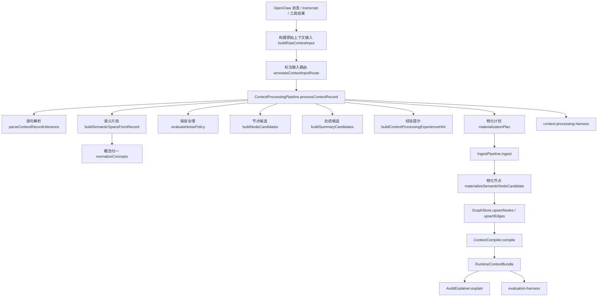
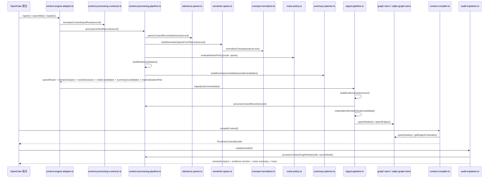

# 上下文处理代码流转图
这份文档对应当前仓库里的“上下文处理”主链，重点说明：

`输入 -> 解析 -> 语义片段 -> 概念归一 -> 噪音治理 -> 总结候选 -> 物化计划 -> 入图 / explain / 评估`

## 总流程图



## 函数级时序图



## 模块对照

| 阶段 | 主要文件 | 作用 |
|---|---|---|
| 输入标准化 | [context-engine-adapter.ts](/d:/C_Project/openclaw_compact_context/src/openclaw/context-engine-adapter.ts) | 把宿主消息转成 `RawContextRecord` |
| route 契约 | [context-processing-contracts.ts](/d:/C_Project/openclaw_compact_context/src/core/context-processing-contracts.ts) | 解析输入来源并固定处理合同 |
| 上下文处理总入口 | [context-processing-pipeline.ts](/d:/C_Project/openclaw_compact_context/src/core/context-processing-pipeline.ts) | 串起解析、归一、噪音治理、总结候选与物化计划 |
| 句子/子句解析 | [utterance-parser.ts](/d:/C_Project/openclaw_compact_context/src/core/utterance-parser.ts) | 中英文 sentence split 与 clause split |
| 语义片段 | [semantic-spans.ts](/d:/C_Project/openclaw_compact_context/src/core/semantic-spans.ts) | 生成 `SemanticSpan + EvidenceAnchor` |
| 概念归一 | [concept-normalizer.ts](/d:/C_Project/openclaw_compact_context/src/core/concept-normalizer.ts) | 中英别名归一到 canonical concept |
| 噪音治理 | [noise-policy.ts](/d:/C_Project/openclaw_compact_context/src/core/noise-policy.ts) | 计算 `drop / evidence_only / hint_only / materialize` |
| 总结候选 | [summary-planner.ts](/d:/C_Project/openclaw_compact_context/src/core/summary-planner.ts) | 产出 `summary candidates` |
| 语义分类 | [semantic-classifier.ts](/d:/C_Project/openclaw_compact_context/src/core/semantic-classifier.ts) | clause -> candidate node types |
| 节点物化 | [semantic-node-materializer.ts](/d:/C_Project/openclaw_compact_context/src/core/semantic-node-materializer.ts) | candidate -> GraphNode |
| 入图 | [ingest-pipeline.ts](/d:/C_Project/openclaw_compact_context/src/core/ingest-pipeline.ts) | 先落 Evidence，再落补充语义节点和边 |
| 编译 | [context-compiler.ts](/d:/C_Project/openclaw_compact_context/src/core/context-compiler.ts) | 图谱 -> `RuntimeContextBundle` |
| explain | [audit-explainer.ts](/d:/C_Project/openclaw_compact_context/src/core/audit-explainer.ts) | 输出 spans、anchor、noise、trace、persistence |
| 专项测试 | [context-processing-harness.ts](/d:/C_Project/openclaw_compact_context/src/evaluation/context-processing-harness.ts) | 独立评估 parse / concept / noise / summary / experience |

## 当前处理逻辑

### 1. 保留原文，不直接重写
上下文处理不会先把用户消息改写成摘要，而是：
- 保留原文 Evidence
- 旁路生成 `parseResult`
- 再生成 `SemanticSpan / ConceptMatch / NodeCandidate`

### 2. 一条消息可以产多个语义原子
当前主链已经不是“message -> 一个主节点”，而是：

`message -> Evidence -> SemanticSpan[] -> 多个补充语义节点`

补充节点可能包括：
- `Goal`
- `Constraint`
- `Process`
- `Step`
- `Topic`
- `Concept`

### 3. 噪音和弱语句不会强行升格
通过 `noise-policy.ts`，弱语句会被分类为：
- `drop`
- `evidence_only`
- `hint_only`
- `materialize`

这使得上下文处理和图谱入图之间有了明确缓冲层。

### 4. 上下文处理已经可以独立测试
现在可以直接跑：

```powershell
npm run test:context-processing
```

它会覆盖：
- 契约
- parser
- concept normalize
- noise policy
- summary planner
- raw-first experience hint
- harness

## 一句话总结

`当前上下文处理已经是一条独立主链：先解析和归一，再决定哪些内容该降级、哪些该总结、哪些该物化入图，最后再接入 compiler、explain 和专项评估。`
