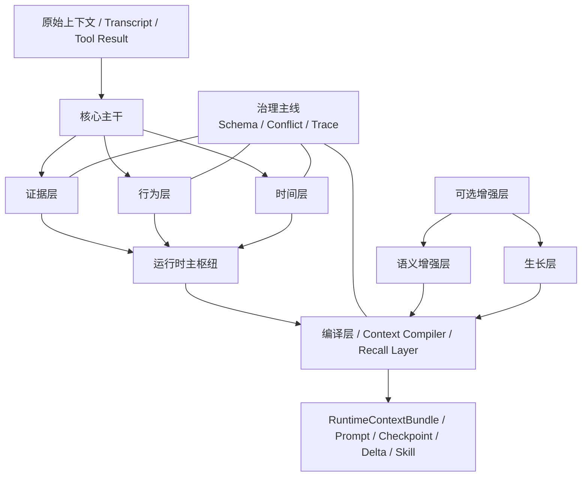

# 面向 OpenClaw 的多层知识图谱架构方案

配套阅读：
- 总体设计: [context-engine-design-v2.zh-CN.md](/d:/C_Project/openclaw_compact_context/docs/context-engine-design-v2.zh-CN.md)
- Hook 到图谱主链: [hook-to-graph-pipeline.zh-CN.md](/d:/C_Project/openclaw_compact_context/docs/hook-to-graph-pipeline.zh-CN.md)
- Provenance 方案: [provenance-schema-plan.zh-CN.md](/d:/C_Project/openclaw_compact_context/docs/provenance-schema-plan.zh-CN.md)
- Schema 治理方案: [schema-governance-plan.zh-CN.md](/d:/C_Project/openclaw_compact_context/docs/schema-governance-plan.zh-CN.md)
- 冲突消解方案: [conflict-resolution-plan.zh-CN.md](/d:/C_Project/openclaw_compact_context/docs/conflict-resolution-plan.zh-CN.md)
- Traceability 方案: [traceability-plan.zh-CN.md](/d:/C_Project/openclaw_compact_context/docs/traceability-plan.zh-CN.md)
- 当前阶段状态: [stage-2-status.zh-CN.md](/d:/C_Project/openclaw_compact_context/docs/stage-2-status.zh-CN.md)

## 1. 文档目标

这份文档不是要再造一套和当前系统平行的新架构，而是把我们已经讨论清楚的方向收敛成一套更适合阶段 3 的设计基线。

它重点回答下面几个问题：

1. 多层知识图谱方案在当前阶段应该怎么改，才更贴近工程实现
2. 哪些层是当前必须稳住的主干，哪些是后续增强
3. 为什么现在比“继续加层”更重要的是 `Schema / Conflict / Trace`
4. 层和层之间到底是什么关系，而不是停留在分类列表
5. 这些层如何和 OpenClaw 原生概念对齐

一句话定义：

`这套知识图谱不是面向百科知识管理，而是面向 LLM 上下文治理、Agent 执行记忆和运行时上下文编译的多层语义图系统。`

## 2. 这版方案为什么要调整

如果只强调“分层”，很容易出现两个问题：

- 文档上看起来结构很多，但工程优先级不清楚
- 层很多，却没有统一治理约束，系统会越做越散

所以这版方案要从“七层并列介绍”改成：

- `三层主干`
- `一层编译`
- `三条治理主线`
- `两类可选增强`

也就是：

`从“我们有哪些层”升级成“哪些层必须先稳、靠什么治理、哪些增强后做”。`

## 3. 总体结构结论

建议把整体架构改成下面这四块：

1. `核心主干`
2. `运行时主枢纽`
3. `治理主线`
4. `可选增强层`

对应关系如下：

- `核心主干`
  - 证据层
  - 行为层
  - 时间层
- `运行时主枢纽`
  - 编译层
- `治理主线`
  - Schema
  - Conflict
  - Trace
- `可选增强层`
  - 语义增强层
  - 生长层

这比“七层并列”更适合当前阶段，因为它能更明确地表达：

- 哪些是必须先做稳的
- 哪些是当前系统的中心
- 哪些是所有层都必须遵守的工程约束
- 哪些是后续增强而不是当前阻塞项

## 4. 顶层架构图



## 5. 核心主干

## 5.1 证据层

### 定位

证据层是整套系统的事实底座。它负责保存“原文是什么、来源是什么、证据如何回查”，而不是直接替代原文做推理。

### 核心理念

- `Evidence-first`
- 图谱主干优先来自原文，而不是来自摘要
- 派生节点必须能回指证据节点

### 主要对象

- `Evidence`
- `SourceRef`
- 原始 `tool result` 的 artifact sidecar 引用
- transcript 中的原始 message / custom message / compaction 证据副本

### 主要职责

- 保存原始内容或原始内容的统一图谱副本
- 提供来源定位：`sourceType / sourcePath / sourceSpan / contentHash`
- 作为 semantic node 的 `supported_by` 依据
- 作为 explain、审计和回查的事实源

### 当前实现映射

已实现：
- [ingest-pipeline.ts](/d:/C_Project/openclaw_compact_context/src/core/ingest-pipeline.ts) 中每条 `RawContextRecord` 必生成一个 `Evidence`
- [sqlite-graph-store.ts](/d:/C_Project/openclaw_compact_context/src/core/sqlite-graph-store.ts) 中的 `nodes + sources`
- [tool-result-artifact-store.ts](/d:/C_Project/openclaw_compact_context/src/openclaw/tool-result-artifact-store.ts) 中的 sidecar artifact

当前判断：
- `状态：已实现主干`

### 设计边界

证据层不负责：
- 直接判断当前 prompt 应该放什么
- 直接承担高阶主题聚类
- 替代编译层做上下文裁决

## 5.2 行为层

### 定位

行为层用于表达 Agent 在一次会话中“做了什么、发生了什么、产出了什么、遇到了什么风险”。

它不是传统静态实体图，更接近“执行轨迹图谱”。

### 主要对象

- `Decision`
- `State`
- `Outcome`
- `Risk`
- `Tool`
- `Process`
- `Step`

### 主要职责

- 把执行过程从“纯文本流水”变成可查询对象
- 把 tool output、失败、阻塞、模式、步骤等变成显式节点
- 支撑“为什么当前被卡住”“上一步做了什么”“哪条工具输出最相关”这类问题

### 当前实现映射

已实现或大部分实现：
- [ingest-pipeline.ts](/d:/C_Project/openclaw_compact_context/src/core/ingest-pipeline.ts) 已识别 `Decision / State / Outcome / Risk / Tool / Process / Step / Mode`
- [context-compiler.ts](/d:/C_Project/openclaw_compact_context/src/core/context-compiler.ts) 已消费这些类型

当前判断：
- `状态：已实现主干`

### 当前不足

- 行为之间的显式边关系还不够丰富
- 当前真正稳定使用的边主要还是 `supported_by`
- `produces / next_step / requires / conflicts_with` 虽然有类型定义，但还没有系统性生成和消费

## 5.3 时间层

### 定位

时间层用于回答“这条知识现在还有效吗，它是什么时候产生的，它是否被更新、替换或过期了”。

这一层对应“时间演化图谱”。

### 主要对象

- 节点与边上的 `version`
- `freshness`
- `validFrom / validTo`
- `checkpoint`
- `delta`

### 主要职责

- 让系统能区分当前有效状态与历史状态
- 表达知识的时间有效性和版本变化
- 为恢复、增量更新、记忆分层提供基础

### 当前实现映射

已实现：
- [core.ts](/d:/C_Project/openclaw_compact_context/src/types/core.ts) 中的 `version / freshness / validFrom / validTo`
- [checkpoint-manager.ts](/d:/C_Project/openclaw_compact_context/src/core/checkpoint-manager.ts) 中的 `checkpoint / delta`
- [sqlite-graph-store.ts](/d:/C_Project/openclaw_compact_context/src/core/sqlite-graph-store.ts) 中的持久化

当前判断：
- `状态：已实现基础主干`

### 当前不足

- 还没有多层 checkpoint
- 还没有真正的历史裁剪解释链
- 冲突和覆盖关系还没有形成稳定的时间裁决模型

## 6. 运行时主枢纽

## 6.1 编译层

### 定位

编译层是整套系统里最关键的层。

因为我们的目标不是“把知识存好”，而是：

`把图谱编译成当前 query 下最小可用的运行时上下文。`

它可以理解为：
- `Context Compiler`
- `Recall Layer`
- `Prompt Selection Layer`

### 主要职责

- 决定哪些节点能进入 prompt
- 决定它们以什么优先级进入
- 决定哪些需要 `raw-first`
- 决定哪些可以 `compressed-fallback`
- 决定哪些只是 explain 用，不必进入 prompt

### 当前实现映射

已实现：
- [context-compiler.ts](/d:/C_Project/openclaw_compact_context/src/core/context-compiler.ts)
- `RuntimeContextBundle`
- `bundle diagnostics`
- selection explain
- `queryMatch`

当前判断：
- `状态：已实现主干`

### 当前不足

- 还没有把“Prompt Readiness”正式沉淀成图谱横切属性
- 还没有真正利用多跳关系做 recall
- 还没有把主题层和长期记忆层正式接入编译路径

## 7. 治理主线

这部分不是“又新增三层”，而是当前阶段最重要的三条工程主线。

比起继续长更多层，阶段 3 更应该优先把这三件事做实：

1. `Schema`
2. `Conflict`
3. `Trace`

## 7.1 Schema

### 定位

Schema 不是单纯的存储字段设计，而是整套系统的统一治理契约。

它要回答：
- 一条知识最少应该长什么样
- 哪些字段是所有层都能稳定读取的
- 哪些字段会被编译层和 explain 直接消费

### 当前我们已经有的

- `type / scope / kind / strength / confidence`
- `sourceRef`
- `provenance`
- `version / freshness / validFrom / validTo`

对应位置：
- [core.ts](/d:/C_Project/openclaw_compact_context/src/types/core.ts)
- [001_init.sql](/d:/C_Project/openclaw_compact_context/schema/sqlite/001_init.sql)

### 现在最缺的

- 更明确的 `Prompt Readiness` 契约
- 更明确的 `Validity` 治理视图
- 更统一的节点治理视图，而不是只靠 payload 散装表达

配套细化方案：
- [schema-governance-plan.zh-CN.md](/d:/C_Project/openclaw_compact_context/docs/schema-governance-plan.zh-CN.md)

### 建议的最小治理契约

建议后续收敛成：

```ts
interface NodeGovernance {
  provenance: ProvenanceRef;
  knowledgeState: 'raw' | 'compressed' | 'derived';
  validity: {
    confidence: number;
    freshness: 'active' | 'stale' | 'superseded';
    validFrom: string;
    validTo?: string;
    conflictStatus?: 'none' | 'potential' | 'confirmed' | 'superseded';
  };
  promptReadiness: {
    eligible: boolean;
    preferredForm: 'raw' | 'summary' | 'citation_only' | 'derived';
    requiresEvidence: boolean;
    requiresCompression: boolean;
    selectionPriority: 'must' | 'high' | 'normal' | 'low';
    budgetClass: 'fixed' | 'reserved' | 'candidate';
  };
}
```

## 7.2 Conflict

### 定位

Conflict 负责解决：

- 哪些知识互相冲突
- 哪些新知识覆盖旧知识
- 哪些约束优先于哪些约束
- 哪些状态只是潜在冲突，哪些已经确认冲突

### 当前我们已经有的

设计预留：
- `conflicts_with`
- `supersedes`
- `overrides`

对应位置：
- [core.ts](/d:/C_Project/openclaw_compact_context/src/types/core.ts)

### 当前不足

- 还没有系统性生成这些边
- 还没有正式的冲突状态字段
- compiler 还没有真正接入冲突裁决

配套细化方案：
- [conflict-resolution-plan.zh-CN.md](/d:/C_Project/openclaw_compact_context/docs/conflict-resolution-plan.zh-CN.md)

### 建议的最小能力

阶段 3 不需要一开始就做复杂冲突推理，先做最小闭环：

1. 节点有 `conflictStatus`
2. 入图时对高价值类型尝试生成：
   - `conflicts_with`
   - `supersedes`
   - `overrides`
3. compiler 在选取时遵守最小规则：
   - `superseded` 默认降权
   - `confirmed conflict` 默认不同时进入 fixed slot
   - `raw` 冲突项优先于 `compressed` 冲突项

## 7.3 Trace

### 定位

Trace 负责把系统从“能解释一部分”推进到“能整链追查”。

它要回答：
- 这条知识从哪来
- 它怎么变成 semantic node
- 它为什么进了 bundle
- 它为什么没进 prompt
- 它后来如何进入 checkpoint / delta / skill candidate

### 当前我们已经有的

- provenance
- selection explain
- bundle diagnostics
- tool result artifact lookup

对应位置：
- [audit-explainer.ts](/d:/C_Project/openclaw_compact_context/src/core/audit-explainer.ts)
- [context-engine-adapter.ts](/d:/C_Project/openclaw_compact_context/src/openclaw/context-engine-adapter.ts)

### 当前不足

- trace 还是分散的，不是统一视图
- 还不能完整解释“某段历史为什么没被保留”
- 还没有形成从输入到 prompt 的全链追查模型

配套细化方案：
- [traceability-plan.zh-CN.md](/d:/C_Project/openclaw_compact_context/docs/traceability-plan.zh-CN.md)

### 建议的最小追查链

建议后续统一成：

```text
raw input
-> RawContextRecord
-> Evidence / Semantic Node
-> ContextSelection
-> RuntimeContextBundle
-> prompt injection
-> checkpoint / delta / skill candidate
```

## 8. 可选增强层

这两层很有价值，但不是当前最优先的阻塞项。

## 8.1 语义增强层

### 定位

语义增强层不是事实底座，而是做主题、概念、问题域和跨材料语义关联。

这一层最接近“主题概念图谱”。

### 主要对象

建议后续引入：
- `Topic`
- `Concept`
- `ProblemDomain`
- `Concern`
- `PatternTag`

### 主要职责

- 把 `provenance / checkpoint / prompt compression / artifact sidecar` 这类概念组织成主题簇
- 支撑跨文档、跨代码、跨会话的语义召回
- 为 query expansion 和 recall enhancement 提供更好的入口

### 当前实现映射

当前仓库中：
- 没有显式 `Topic / Concept` 节点
- 只有轻量的文本匹配和类型打分

当前判断：
- `状态：未正式实现`

### 阶段建议

先不要一开始就引入复杂本体，建议从最小可用主题层开始：

- 先做 `Topic` 节点
- 再做 `relates_to / belongs_to_topic`
- 再让 compiler 在 query 无法精确命中时借主题层做二跳召回

## 8.2 生长层

### 定位

生长层负责沉淀“模式、洞察、反思、可复用技能、弱连接知识”，不是主运行时事实层。

这一层更接近：
- `Zettelkasten 链接图谱`
- `Skill / Insight / Note`

### 主要对象

当前与未来建议对象：
- `SkillCandidate`
- `Skill`
- `Insight`
- `Note`
- `Pattern`

### 主要职责

- 从多次出现的稳定模式中长出技能候选
- 存放设计经验、失败教训、可复用策略
- 支撑长期复用和项目记忆生长

### 当前实现映射

已实现基础版：
- [skill-crystallizer.ts](/d:/C_Project/openclaw_compact_context/src/core/skill-crystallizer.ts)
- [sqlite-graph-store.ts](/d:/C_Project/openclaw_compact_context/src/core/sqlite-graph-store.ts) 中的 `skill_candidates`

当前判断：
- `状态：已实现轻量版`

### 当前不足

- 还没有 `Insight / Note / Pattern` 独立层
- skill 仍然偏“从 bundle 生成候选”，还不是多轮统计后的稳定能力
- Zettelkasten 式弱连接还没有正式进入数据模型

## 9. 层间关系

这一部分很重要，因为如果只有层的分类，没有层间关系，这份方案还是不够工程化。

建议把层间关系拆成 3 类：

1. `数据流`
2. `依赖关系`
3. `反向约束`

## 9.1 数据流

当前主链的数据流建议明确成：

```text
原始输入
-> 证据层记录
-> 行为层语义化
-> 时间层沉淀版本与状态
-> 编译层装配运行时上下文
-> checkpoint / delta / skill candidate
```

## 9.2 依赖关系

建议明确下面这些关系：

- `证据层 -> 行为层`
  行为节点必须可追溯到证据
- `证据层 -> 时间层`
  时间状态必须依附于具体知识对象，而不是脱离证据单独存在
- `证据层 / 行为层 / 时间层 -> 编译层`
  编译层从主干读，不直接制造事实
- `核心主干 -> 可选增强层`
  主题层和生长层依赖主干，但不替代主干
- `治理主线 -> 所有层`
  Schema、Conflict、Trace 贯穿所有层

## 9.3 反向约束

比依赖关系更重要的是反向约束：

- `编译层` 不能反写原始事实层
- `语义增强层` 不能覆盖原文证据
- `生长层` 不能直接升格为高可信事实源
- `compressed / derived` 不应反向污染 `raw`
- `Trace` 只能补解释，不应该重写事实本身

## 10. 对齐 OpenClaw 原生概念

这部分的目标不是把宿主所有概念都图谱化，而是做一张最小必要映射表，让架构和项目实际语言一致。

建议遵守：

- 先做 `最小概念映射`
- 再决定哪些对象真的要入图
- 不要一开始把所有宿主对象都做成图节点

## 10.1 最小映射表

| OpenClaw 原生概念 | 当前宿主语义 | 图谱层中的定位 | 建议落点 |
| --- | --- | --- | --- |
| `Session` | 会话主上下文范围 | 核心主干的范围边界 | `scope + sessionId`，必要时可做锚点对象 |
| `Transcript Entry` | 持久化历史记录单元 | 证据层输入 | `RawContextRecord -> Evidence` |
| `Live Message Snapshot` | 实时消息视图 | 证据层输入 | `RawContextRecord` |
| `Tool Result` | 工具执行结果 | 证据层 + 行为层 | `Evidence / State / Risk / Tool` |
| `tool_result_persist` Hook | 工具结果持久化生命周期事件 | 行为触发事件 + 证据来源修正 | provenance / artifact / compression metadata |
| `before_compaction / after_compaction` Hook | 压缩生命周期事件 | 时间层与编译链协同事件 | session state sync / checkpoint refresh |
| `Context Engine` | 上下文主入口 | 编译层宿主接口 | `bootstrap / ingest / afterTurn / assemble / compact` |
| `RuntimeContextBundle` | 一轮运行时上下文产物 | 编译层核心产物 | `compile_context` 结果 |
| `Gateway Debug Method` | 调试调用入口 | Trace 的外部观察接口 | `explain / query_nodes / inspect_bundle` |
| `Skill Candidate` | 可复用能力候选 | 生长层产物 | `skill_candidates` |

## 10.2 当前不建议直接图谱化的概念

下面这些先不建议做成正式 graph node：

- 每个 Gateway 调试方法本身
- 宿主所有内部 runtime object
- 所有插件配置对象
- 宿主侧所有非上下文核心事件

原因是：
- 会引入很多噪音
- 对当前上下文治理收益不高
- 会让图谱过早背上“宿主全量对象镜像”的负担

## 11. 当前代码与新结构映射

| 结构块 | 设计定位 | 当前代码映射 | 状态 |
| --- | --- | --- | --- |
| 核心主干 / 证据层 | 原文证据与来源底座 | `Evidence`、`SourceRef`、artifact sidecar | 已实现主干 |
| 核心主干 / 行为层 | 执行轨迹与过程语义 | `Decision / State / Risk / Tool / Process / Step / Outcome` | 已实现主干 |
| 核心主干 / 时间层 | 状态演化与记忆更新 | `version / freshness / validFrom / checkpoint / delta` | 已实现基础主干 |
| 运行时主枢纽 / 编译层 | Recall / Context Compiler | `ContextCompiler`、bundle diagnostics、explain | 已实现主干 |
| 治理主线 / Schema | 统一节点契约与运行时契约 | `core.ts`、`io.ts`、`001_init.sql` | 部分实现 |
| 治理主线 / Conflict | 冲突、覆盖、裁决 | edge type 已预留，主逻辑未落地 | 未实现主干 |
| 治理主线 / Trace | 从输入到 prompt 的追查链 | provenance、selection explain、artifact lookup | 部分实现 |
| 可选增强 / 语义增强层 | 主题、概念、问题域 | 暂无正式 `Topic / Concept` 模型 | 未实现 |
| 可选增强 / 生长层 | Skill / Insight / Note / Pattern | `skill_candidates` 轻量版 | 已实现轻量版 |

## 12. 当前最重要的设计原则

为了避免阶段 3 走偏，建议把下面几条原则写死：

### 原则 1：Evidence-first

图谱主干优先来自原文证据，不来自摘要。

### 原则 2：Compiler-oriented

图谱不是终点，编译成 `RuntimeContextBundle` 才是终点。

### 原则 3：Schema before expansion

在扩展更多层之前，先把统一治理 schema 做稳。

### 原则 4：Conflict before richness

在引入更多关系和主题层之前，先把最小冲突消解链补齐。

### 原则 5：Trace before complexity

系统复杂度升高前，要先保证从输入到 prompt 的整链可追查。

### 原则 6：Local-first

主存储、主裁决、主压缩链优先自己实现，本地可审计。

## 13. 阶段 3 推荐落地顺序

如果按投入产出比来排，建议阶段 3 这么推进：

### P0

- 先补 `Schema`
  - 统一治理结构
  - 把 `Prompt Readiness` 显式化
  - 把 `Knowledge State` 视图稳定下来
- 再补 `Conflict`
  - 定义最小冲突模型
  - 生成 `conflicts_with / supersedes / overrides`
  - compiler 接入最小裁决逻辑
- 再补 `Trace`
  - 统一从输入到 node、bundle、prompt、checkpoint 的追查链

### P1

- 补层间关系真正对应的边与 explain
- 引入最小 `Topic` 节点与主题边
- 让 recall 支持主题层二跳召回
- 给 explain 增加“为什么没保留某段历史”的解释

### P2

- 扩展生长层，加入 `Insight / Note / Pattern`
- 提升 skill 从“候选”到“稳定模式”的升格机制
- 进一步丰富关系层和长期记忆策略

## 14. 推荐的数据演进方式

这套方案不建议一次性大改 schema，而建议分 3 步演进：

### 第一步

先在类型层补治理结构，不急着单独建表。

### 第二步

把 `Prompt Readiness` 和 `Validity.conflictStatus` 先放进 node payload 或 governance 结构里，由 compiler / explain 读取。

### 第三步

等查询稳定后，再决定是否：
- 加单独字段
- 加索引
- 加专门的 `governance_json`

## 15. 一句话结论

`OpenClaw 的知识图谱最合理的形态，不是单层实体图，也不是简单的七层堆叠，而是“证据层 + 行为层 + 时间层”为核心主干，“编译层”为运行时主枢纽，“Schema / Conflict / Trace”为治理主线，“语义增强层 + 生长层”为后续增强的多层语义图体系。`
