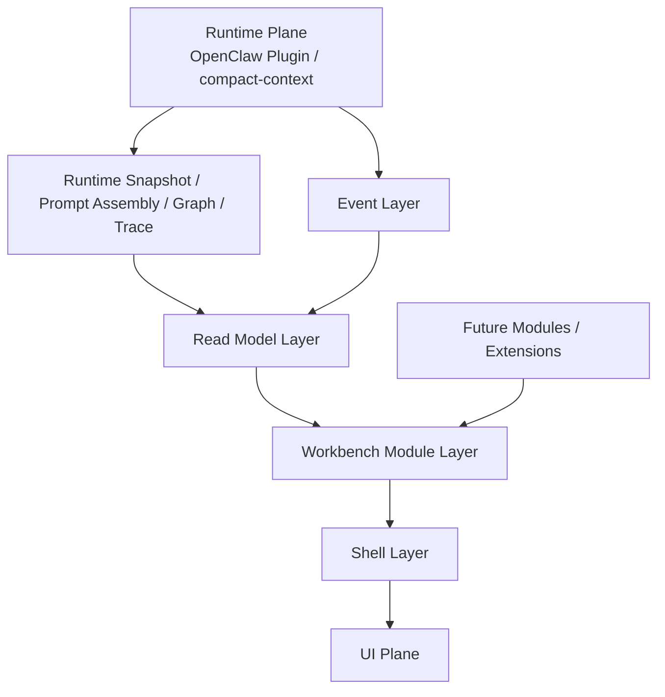

# Agent Workbench 平台重构总方案

配套阅读：
- 执行 TODO：[agent-workbench-platform-rebuild-todo.zh-CN.md](/d:/C_Project/openclaw_compact_context/docs/planning/agent-workbench-platform-rebuild-todo.zh-CN.md)
- Runtime / Control / UI 分层基线：[layered-knowledge-graph-architecture.zh-CN.md](/d:/C_Project/openclaw_compact_context/docs/architecture/layered-knowledge-graph-architecture.zh-CN.md)
- Traceability 主线：[traceability-plan.zh-CN.md](/d:/C_Project/openclaw_compact_context/docs/architecture/traceability-plan.zh-CN.md)
- Runtime Context Window contract：[runtime-context-window-contract.zh-CN.md](/d:/C_Project/openclaw_compact_context/docs/context-processing/runtime-context-window-contract.zh-CN.md)
- Prompt Assembly contract：[prompt-assembly-contract.zh-CN.md](/d:/C_Project/openclaw_compact_context/docs/context-processing/prompt-assembly-contract.zh-CN.md)
- Runtime Snapshot Persistence：[runtime-snapshot-persistence.zh-CN.md](/d:/C_Project/openclaw_compact_context/docs/context-processing/runtime-snapshot-persistence.zh-CN.md)
- Control Plane contracts：[control-plane-service-contracts.zh-CN.md](/d:/C_Project/openclaw_compact_context/docs/control-plane/control-plane-service-contracts.zh-CN.md)
- Dashboard Observability contracts：[dashboard-observability-contracts.zh-CN.md](/d:/C_Project/openclaw_compact_context/docs/control-plane/dashboard-observability-contracts.zh-CN.md)

## 1. 文档目标

这份文档用于把“现有平台壳推翻重来，但保留已经正确的 Runtime / Graph / Trace 底座”收成一份可执行总方案。

它重点回答 7 个问题：

1. 新平台要解决什么问题
2. 为什么要重做，以及哪些东西不能一起推翻
3. 平台总架构应该长什么样
4. 第一优先为什么是“上下文相关监控”
5. 第一版需要哪些 contract、事件、API、页面和存储
6. 把上下文压缩插件装到 OpenClaw 后，如何用这个平台调试效果
7. 后续如果平台继续加别的能力，架构怎么保证不再推翻一次

一句话目标：

`把当前零散的 control-plane / inspect / debug / graph 能力，收成一个可扩展的 Agent Workbench 平台；第一版优先把上下文监控做扎实，让 compact-context 插件装进 OpenClaw 后能直接观测和调试真实效果。`

## 2. 一句话结论

推荐的新平台不是“重做一个首页”，而是：

`重做 UI Plane + Control Plane Read Model + Workbench 壳；继续保留 Runtime Plane、知识图谱、traceability、runtime snapshot 和 prompt assembly 这些真相层。`

也就是说：

- `要重做`
  - 平台壳
  - 页面结构
  - 控制面 API 组织方式
  - 统一 read-model
  - 统一事件模型
- `不要重做`
  - `compact-context` 插件主链
  - `runtime snapshot`
  - `prompt assembly`
  - `trace / provenance`
  - `graph store`
  - `checkpoint / delta / skill candidate`

## 3. 为什么要重做

### 3.1 当前问题不在底层，而在平台壳

从当前仓库状态看，底层已经有一批正确且有价值的能力：

- `assemble()` 主治理路线
- `runtime window / prompt assembly / runtime snapshot`
- `inspect_bundle / inspect_runtime_window / explain`
- `dashboard / snapshot history / metric cards`
- `graph + provenance + traceability`

但平台层仍然有明显问题：

- 当前 console 更像“已有能力的展示壳”，不是围绕排障工作流组织
- 调试入口分散在 CLI、gateway、dashboard、query、trace 里
- “上下文看板”“agent 当前动作”“图谱解释”“timeline”“告警”没有收成统一工作台
- 平台还没有把后续扩展位先设计出来，继续迭代容易再长成一层临时页

### 3.2 为什么不能把底层一起推翻

如果把 Runtime / Graph / Trace 也一起推翻，会有 4 个高风险：

1. 失去当前已经可工作的上下文治理主链
2. 失去已经收好的真相源优先级
3. 失去压缩效果验证所依赖的 inspect / snapshot 闭环
4. UI 重做会和底层重做耦死，交付会无限后延

所以这次重做的正确边界应该是：

`重做平台编排、页面和 read-model，不重做真相层。`

## 4. 新平台要达成的目标

平台第一阶段只围绕一个目标推进：

`让我们能稳定看见 agent 当前上下文、推送给 LLM 的内容、原文来源、图谱关系、每步动作和上下文压缩效果，从而能把 compact-context 插件装进 OpenClaw 后进行真实调试。`

把这个目标拆开，平台至少要回答下面这些问题：

1. 当前 agent 在干什么
2. 这一轮真正送给 LLM 的上下文是什么
3. 这些上下文来自哪些原文、哪些图谱节点、哪些压缩层
4. 当前上下文占比多少，是否触发了压缩
5. 为什么某条知识被召回、被保留、被省略或被压缩
6. 每一步执行发生了什么
7. 当前是否出现了异常，例如：
   - context occupancy 过高
   - transcript fallback 过多
   - tool 调用长时间未返回
   - 插件压缩没有生效

## 5. 重构边界与不变式

### 5.1 边界

当前推荐固定成三层：

- `Runtime Plane`
  - 继续承载 OpenClaw 插件在线主链
  - 继续掌握知识写入、上下文编译、压缩状态、checkpoint / delta / skill 的权威
- `Control Plane`
  - 承载 read-model、查询、观测、治理、导入、后续工作台 API
  - 默认只读消费 Runtime / Snapshot / Transcript / Graph / Trace
- `UI Plane`
  - 承载 Workbench
  - 只调用 control-plane，不直接触底层存储

### 5.2 不变式

这次重构建议直接锁死下面这些不变式：

1. 真相源优先级仍然是：
   - `assemble.final`
   - `runtime snapshot`
   - `transcript / raw evidence`
2. `raw / compressed / derived` 必须分层显示，不能混成一层
3. Runtime Plane 继续是在线知识写入与上下文编译权威
4. Control Plane 默认不直接写底层 SQLite
5. UI 只消费 read-model，不直接扫原始表或拼零散 payload
6. 知识图谱视图必须支持：
   - `included`
   - `omitted`
   - `superseded`
   - `suppressed`
   - `summary_only`
7. 当前动作必须显式状态机化，不能靠日志猜

## 6. 平台总架构

## 6.1 总体分层

建议把新平台收成下面这 5 层：

1. `Event Layer`
2. `Read Model Layer`
3. `Workbench Module Layer`
4. `Shell Layer`
5. `Extension Layer`



### 6.1.1 Event Layer

目标：

- 统一记录 agent 运行过程中的关键步骤
- 给后续的 timeline / graph / observability / replay / alerts 提供共同输入

为什么选它：

- 现在各处已有 runtime snapshot、dashboard、trace、import trace，但还缺统一“agent 运行事件面”
- 先统一事件，后续加新模块时不用再返工整个平台

关键输入：

- runtime API 生命周期
- tool call / tool result
- prompt assembly
- checkpoint / delta / skill
- governance / import / extension 等后续平台能力

关键输出：

- `AgentRunEvent[]`
- 实时订阅流
- 回放流

### 6.1.2 Read Model Layer

目标：

- 把底层复杂数据变成 UI 可直接消费的稳定视图

为什么选它：

- UI 不应该去理解 runtime snapshot、graph node、trace、dashboard 各自的细节
- 先做 read-model，后续页面、过滤器、图谱视图都能复用

关键输入：

- Event Layer
- runtime snapshot
- prompt assembly snapshot
- graph / trace / checkpoint / delta / skill

关键输出：

- `CurrentActionReadModel`
- `ContextWorkbenchReadModel`
- `TimelineReadModel`
- `GraphWorkbenchReadModel`
- `ObservabilityReadModel`

### 6.1.3 Workbench Module Layer

目标：

- 让“上下文、图谱、timeline、observability、治理、导入”这些能力按模块挂接，不互相硬编码

为什么选它：

- 你已经明确后续平台还会继续加东西
- 如果现在不先模块化，后面很容易再次推翻

关键输入：

- 模块 manifest
- 模块依赖的 read-model

关键输出：

- 页面注册
- drilldown 注册
- 卡片注册
- live panel 注册

### 6.1.4 Shell Layer

目标：

- 统一布局、导航、搜索、筛选、订阅、通知和工作区切换

为什么选它：

- 这些能力不属于上下文监控本身，但平台所有模块都要用

关键输入：

- 模块注册结果
- 当前 workspace / session / run / step

关键输出：

- Workbench 容器
- 路由
- 全局过滤器
- 实时连接

### 6.1.5 Extension Layer

目标：

- 给后续未确定的平台能力留正式扩展位

为什么选它：

- 你已经明确“目前就这些，后面平台可能还会加入其他东西”
- 所以第一版不能把平台做成固定页面树

关键输入：

- 模块扩展声明
- extension manifest

关键输出：

- 新模块挂载
- 新卡片挂载
- 新 drilldown 挂载

## 6.2 工作台模块建议

建议当前先定义下面这些模块位：

- `live`
- `context`
- `graph`
- `timeline`
- `trace`
- `observability`
- `governance`
- `import`
- `evaluation`
- `knowledge`
- `workspace`
- `platform`

第一版实际落地优先做：

1. `live`
2. `context`
3. `graph`
4. `timeline`
5. `observability`

## 7. 统一事件模型

## 7.1 目标

先把平台长成“事件驱动工作台”，而不是“调试页集合”。

## 7.2 核心事件合同

建议新增统一事件合同：

```ts
interface AgentRunEvent {
  id: string;
  workspaceId?: string;
  sessionId: string;
  agentId: string;
  runId: string;
  stepId?: string;
  parentStepId?: string;
  traceId: string;
  spanId?: string;
  eventType:
    | 'run_started'
    | 'current_action_changed'
    | 'context_assembled'
    | 'prompt_built'
    | 'llm_request_started'
    | 'llm_request_finished'
    | 'tool_call_started'
    | 'tool_result_ingested'
    | 'checkpoint_persisted'
    | 'delta_persisted'
    | 'skill_candidate_persisted'
    | 'compaction_applied'
    | 'run_completed'
    | 'run_failed';
  status: 'started' | 'streaming' | 'completed' | 'failed';
  startedAt: string;
  endedAt?: string;
  payloadRef?: {
    runtimeSnapshotId?: string;
    promptAssemblyId?: string;
    graphSubgraphId?: string;
    checkpointId?: string;
    deltaId?: string;
    skillCandidateId?: string;
  };
  metrics?: {
    durationMs?: number;
    tokenBudget?: number;
    estimatedTokens?: number;
    contextOccupancyRatio?: number;
  };
}
```

## 7.3 当前动作状态机

建议第一版直接固定为：

```ts
type AgentCurrentAction =
  | 'idle'
  | 'bootstrapping'
  | 'ingesting'
  | 'assembling_context'
  | 'building_prompt'
  | 'waiting_llm'
  | 'streaming_response'
  | 'waiting_tool'
  | 'ingesting_tool_result'
  | 'compacting'
  | 'persisting_memory'
  | 'completed'
  | 'failed';
```

关键不变式：

- 同一时刻一个 `agentId + runId` 只有一个 current action
- 状态切换必须带时间戳
- 失败态必须带错误摘要和最后成功 step

## 8. 统一 read-model

## 8.1 上下文工作台 Read Model

目标：

- 明确“这一轮真正送给 LLM 的上下文是什么”

建议合同：

```ts
interface ContextWorkbenchReadModel {
  workspaceId?: string;
  sessionId: string;
  agentId: string;
  runId: string;
  stepId?: string;
  source: 'live_runtime' | 'persisted_snapshot' | 'transcript_fallback';
  query: string;
  totalBudget: number;
  estimatedTokens: number;
  contextOccupancyRatio: number;
  compression: {
    mode: 'none' | 'incremental' | 'full';
    reason?: string;
    baselineId?: string;
    rawTailStartMessageId?: string;
    retainedRawTurnCount: number;
  };
  inbound: {
    messages: AgentMessageLike[];
  };
  preferred: {
    messages: AgentMessageLike[];
  };
  final: {
    messages: AgentMessageLike[];
  };
  systemPromptAddition?: string;
  promptAssembly?: {
    providerNeutralOutputs: string[];
    hostAssemblyResponsibilities: string[];
  };
  selectedNodes: string[];
  recalledNodes: Array<{
    nodeId: string;
    included: boolean;
    recallKinds?: string[];
  }>;
  latestPointers: Record<string, unknown>;
  toolCallResultPairs: Record<string, unknown>[];
}
```

关键输入：

- `inspect_runtime_window`
- `inspect_bundle`
- prompt assembly snapshot

关键输出：

- 当前上下文详情页
- 当前压缩状态卡
- 当前 recalled / omitted 节点列表

## 8.2 时间线工作台 Read Model

目标：

- 看“每个 agent 每步做了什么”

建议合同：

```ts
interface TimelineReadModel {
  workspaceId?: string;
  sessionId: string;
  agentId: string;
  runId: string;
  currentAction: AgentCurrentAction;
  steps: Array<{
    stepId: string;
    eventType: string;
    status: string;
    startedAt: string;
    endedAt?: string;
    durationMs?: number;
    summary: string;
  }>;
}
```

## 8.3 图谱工作台 Read Model

目标：

- 把“运行时上下文解释”和“知识图谱浏览”收成两个模式，但复用同一套图读模型

建议合同：

```ts
interface GraphWorkbenchReadModel {
  mode: 'runtime_subgraph' | 'global_graph';
  workspaceId?: string;
  sessionId?: string;
  runId?: string;
  focusNodeId?: string;
  nodes: Array<{
    id: string;
    type: string;
    label: string;
    scope?: string;
    knowledgeState?: 'raw' | 'compressed' | 'derived';
    included?: boolean;
    omitted?: boolean;
    suppressed?: boolean;
    superseded?: boolean;
    recallKinds?: string[];
  }>;
  edges: Array<{
    id: string;
    fromId: string;
    toId: string;
    type: string;
    confidence?: number;
  }>;
  traceSamples?: Array<{
    nodeId: string;
    sourceStage?: string;
    selectionReason?: string;
    checkpointId?: string;
  }>;
}
```

## 8.4 Observability Read Model

目标：

- 看“系统健康度”

建议继续复用当前 dashboard / history contract，并在平台层加：

- 运行中 session 列表
- 当前告警 session drilldown
- 与 timeline / graph / context 的联动入口

## 9. 第一优先：上下文监控

## 9.1 为什么优先做它

因为当前最直接的产品目标不是“把平台做漂亮”，而是：

`把上下文压缩插件装进 OpenClaw 后，能看见它到底有没有按预期工作。`

所以第一版平台必须先回答下面这些问题：

1. 当前 `assemble()` 看到的原始消息是什么
2. 当前 `preferred / final` 窗口是什么
3. 当前 `systemPromptAddition` 是什么
4. 当前上下文占比是多少
5. 当前压缩模式是什么，为什么触发
6. 当前 raw tail 保留了哪些 turn block
7. 当前 recalled 了哪些节点，哪些最终 omitted
8. 当前真实送给宿主的 provider-neutral 输出是什么
9. 当前宿主最终送给 LLM 的 payload 是什么

其中第 9 条属于“宿主最终送模视图”，建议新增独立观测层，不把它塞回 context engine 主 contract。

## 9.2 上下文监控第一版页面

建议 P0 直接做 3 个页面：

### 页面 1：Live Session

目标：

- 先回答“现在发生了什么”

内容：

- 当前 agent
- 当前 action
- 最近 10 个 step
- 当前上下文占比
- 当前是否在压缩 / waiting_tool / waiting_llm

### 页面 2：Context Workbench

目标：

- 回答“这轮真正送模的上下文是什么”

内容：

- `inbound / preferred / final`
- `systemPromptAddition`
- `estimatedTokens / totalBudget / contextOccupancyRatio`
- `compressionMode / compressionReason / baselineId`
- `rawTail`
- recalled / omitted 节点清单

### 页面 3：Prompt / Message Drilldown

目标：

- 回答“原文、当前窗口、最终送模内容之间是什么关系”

内容：

- transcript / raw evidence 引用
- runtime final messages
- host final provider payload preview
- message diff

## 9.3 上下文监控第一版 API

建议先补下面这些 control-plane API：

1. `GET /api/live/agents`
   - 当前在线 agent 与 current action
2. `GET /api/runs/:runId/context`
   - 当前上下文 workbench read-model
3. `GET /api/runs/:runId/messages`
   - `transcript / inbound / preferred / final / provider_payload` 多视图切换
4. `GET /api/runs/:runId/prompt`
   - prompt assembly 与最终 payload 预览
5. `GET /api/runs/:runId/graph?mode=runtime_subgraph`
   - 当前运行时子图
6. `GET /api/runs/:runId/timeline`
   - 当前 run 的 timeline
7. `GET /api/stream/live`
   - SSE，推 current action、step、context occupancy、alerts

## 9.4 上下文监控第一版存储

建议第一版新增或强化下面这几类只读存储对象：

1. `agent_run_events`
   - 事件流
2. `agent_current_actions`
   - 当前动作
3. `prompt_assembly_snapshots`
   - 宿主最终送模预览
4. `runtime_subgraph_snapshots`
   - 当前运行时子图
5. `message_archive_refs`
   - 原文索引引用

注意：

- transcript / artifact / evidence 继续是原文真相层
- read-model 只保留引用或摘要，不再重复保存大文本正文

## 10. 知识图谱可视化如何接进平台

## 10.1 目标

知识图谱可视化不是一个孤立页面，而是平台里的“解释层”。

它要回答：

- 哪些知识进入了当前上下文
- 哪些知识被召回但没有留下
- 当前知识和 tool result、风险、过程、决策怎么连起来
- 当前知识处于 `raw / compressed / derived` 哪一层
- 哪些知识已经 superseded / suppressed / promoted

## 10.2 第一版只做运行时子图

第一版不要上来就画全库大图，优先做：

- `runtime_subgraph`

它固定围绕：

- 当前 bundle 选中节点
- 当前 recalled 但 omitted 的节点
- 当前 raw tail 相关 Evidence
- 当前 checkpoint / delta / skill candidate 的最近关联节点

## 10.3 后续再做全局图

第二版再扩：

- `global_graph`
- workspace / global 级图谱浏览
- graph diff
- 节点演化与时间回放

## 11. 第三方借鉴建议

这次平台重构建议“借分类和底座”，不把第三方平台当真相源。

### 11.1 推荐借鉴清单

1. `OpenTelemetry`
   - 作为 traces / metrics / logs 的统一底座
2. `Cytoscape.js`
   - 作为知识图谱主视图
3. `React Flow`
   - 作为 step flow / agent timeline / handoff 图
4. `Sigma.js`
   - 作为后续大图浏览增强
5. `Langfuse / Phoenix`
   - 作为 tracing / eval / agent 调试体验的借鉴对象

### 11.2 当前推荐选型

第一版推荐：

- traces / metrics：`OpenTelemetry`
- 图谱主视图：`Cytoscape.js`
- agent 时间线 / step 图：`React Flow`

后续如果全局图谱变大，再加：

- `Sigma.js`

## 12. UI / UX 设计方案

这部分不是单独谈“页面好不好看”，而是把 UI 当成调试链路的一部分来设计。

平台第一版最重要的任务不是展示所有能力，而是让人能在 10 到 20 秒内回答下面几个问题：

1. 当前 agent 在干什么
2. 这一轮真正送给 LLM 的是什么
3. 压缩有没有生效
4. 为什么某条消息、某个节点、某个 step 会出现在这里
5. 当前需要优先处理的异常是什么

### 12.1 设计目标

UI 第一版建议固定 5 个目标：

1. `运行态优先`
   - 先看当前 live 状态，再看历史
2. `解释优先`
   - 不只展示数据，还要能追到 message / graph / trace / raw evidence
3. `联动优先`
   - 点一个对象，其他面板同步高亮
4. `排障优先`
   - 优先回答“为什么压缩没生效 / 为什么上下文变成这样”
5. `可扩优先`
   - 现在先做上下文监控，后面加治理、导入、评测时不推翻壳层

### 12.2 信息架构

建议采用固定的工作台导航，而不是按底层 service 或 API 名称堆菜单。

第一版主导航建议固定为：

1. `Live`
2. `Context`
3. `Prompt`
4. `Graph`
5. `Timeline`
6. `Observability`

后续扩展导航：

1. `Governance`
2. `Import`
3. `Evaluation`
4. `Knowledge`
5. `Workspace`
6. `Platform`

推荐理由：

- `Live / Context / Prompt / Graph / Timeline / Observability` 正好覆盖当前排障主线
- 页面名称直接对应用户心智，而不是内部实现细节
- 后续新增模块时可以作为二级入口接入，不污染第一屏

### 12.3 页面布局建议

推荐把主界面固定成 `Shell + Global Runtime Bar + Multi-panel Workbench` 三层。

#### 12.3.1 Shell

左侧固定导航栏：

- 放模块入口
- 放 workspace / session 切换
- 放全局筛选入口
- 放当前告警数量和运行总览

顶部固定运行条：

- `workspace`
- `sessionId`
- `agentId`
- `runId`
- `currentAction`
- `contextOccupancyRatio`
- `compressionMode`
- `latestAlertLevel`

这个运行条必须全局固定，因为它是用户在任何页面都需要持续看到的最小状态摘要。

#### 12.3.2 Workbench 主区域

主区域默认采用三栏联动布局：

1. 左栏：导航式面板
   - timeline 列表
   - session 列表
   - recent runs
   - quick filters
2. 中栏：主体面板
   - 上下文视图
   - prompt 视图
   - graph 视图
   - observability 图表
3. 右栏：详情抽屉
   - message detail
   - graph node detail
   - step detail
   - raw evidence / provenance

推荐理由：

- 中栏负责“看全貌”
- 左栏负责“切对象和切范围”
- 右栏负责“看解释和证据”

这样用户不需要频繁跳整页，排障效率会比“列表页 -> 详情页 -> 返回”高很多。

#### 12.3.3 页面跳转原则

第一版尽量少做全屏跳转，优先采用：

- 工作台内切 tab
- 右侧详情抽屉
- 面板内 drilldown

只有遇到下面这些场景才建议整页详情：

- 历史回放
- 全局大图浏览
- 大型评测结果
- 工作区级治理页

### 12.4 页面级建议

#### 12.4.1 Live

这是第一屏，目标是回答“现在系统在干什么”。

建议包含：

- 当前 active agents 列表
- 当前 current action
- 最近 10 到 20 条 step 事件
- 当前 alerts
- 当前最需要处理什么的摘要卡

页面上半部分是摘要卡，下半部分是 live timeline。

#### 12.4.2 Context

这是 P0 最高优先页面，目标是回答“这一轮上下文到底是什么样”。

建议固定 4 个区块：

1. `Context Summary`
   - `estimatedTokens`
   - `totalBudget`
   - `contextOccupancyRatio`
   - `compressionMode`
   - `compressionReason`
2. `Window Compare`
   - `inbound`
   - `preferred`
   - `final`
3. `Retention / Omission`
   - `rawTail`
   - `recalledNodes`
   - `omittedNodes`
4. `Source Layer`
   - `raw`
   - `compressed`
   - `derived`

第一版一定要支持 compare 视图，不然“压缩前后差异”很难看出来。

#### 12.4.3 Prompt

目标是回答“最终送模的 prompt / messages 到底是什么”。

建议拆成两个视角：

1. `Logical View`
   - system / developer / user / assistant / tool messages
   - `systemPromptAddition`
   - prompt slot 来源
2. `Provider Payload View`
   - 最终 provider-neutral payload preview
   - 如有必要，再显示宿主最终 transport payload 快照

这两个视角不能混成一层，否则用户会分不清“context engine 输出”和“宿主最终送模结果”。

#### 12.4.4 Graph

目标是回答“这些上下文和知识图谱的关系是什么”。

第一版先做 `runtime_subgraph`：

- included 节点
- omitted 节点
- recalled 节点
- raw evidence 节点
- checkpoint / delta / skill 最近邻节点

点击任一节点后，右栏必须能看：

- provenance
- why included / omitted
- related messages
- related steps
- related raw evidence

#### 12.4.5 Timeline

目标是回答“这一轮 agent 每一步做了什么”。

建议采用时间轴 + step 卡片，不建议做纯表格。

step 卡片第一版至少显示：

- `stepType`
- `status`
- `startedAt / endedAt`
- `durationMs`
- `summary`
- `toolName`
- `llmRequestId`
- `linkedTraceId`

#### 12.4.6 Observability

目标是回答“系统健康不健康，压缩有没有长期收益”。

第一版以趋势卡片和简图为主：

- `runtime_live_window_ratio`
- `runtime_transcript_fallback_ratio`
- `runtime_average_compressed_count`
- `runtime_average_final_message_count`
- alerts
- snapshot history

### 12.5 关键交互原则

#### 12.5.1 一切对象都可追

任意对象点开后，至少能跳到其中两个以上的相关面：

- message -> graph node / timeline step / raw evidence
- graph node -> related message / trace / checkpoint
- step -> related prompt / tool result / graph diff

这条原则直接借鉴观测系统里的 drilldown 和 trace correlation 思路。

#### 12.5.2 一切状态都可解释

凡是显示状态，都尽量不要只显示 code 或 badge。

例如：

- `compressionMode=incremental`
  - 旁边要直接显示“因 context occupancy 达到阈值，执行增量压缩”
- `omitted`
  - 旁边要显示“已召回，但因预算或优先级未进入 final bundle”

#### 12.5.3 一切核心对象都可对比

第一版建议直接支持这些 compare：

- `inbound vs preferred vs final`
- `plugin 前 vs plugin 后`
- `compression 前 vs compression 后`
- `本轮 vs 上一轮`

这会直接提高你调试 compact-context 的效率。

#### 12.5.4 Quick Filter 要始终轻量

建议固定支持：

- `workspace`
- `session`
- `agent`
- `only-alerts`
- `only-compressed`
- `only-failed`
- `time range`

并支持本地偏好持久化。

### 12.6 视觉系统建议

#### 12.6.1 整体气质

不建议做成：

- 通用 SaaS 后台
- 全黑运维屏
- 纯聊天窗口

更适合的是：

- `控制塔 + 纸面工作台 + 调试台`

也就是：

- 保留一定的工作台仪表感
- 保留当前仓库已有的暖色、纸面、信息密度较高的气质
- 但把视觉重点从“首页海报”切到“运行信息联动”

#### 12.6.2 颜色建议

延续当前壳层暖色基调是合理的，但建议更明确区分功能色：

- `base`
  - 米白 / 亚麻 / 暖灰，作为工作台背景
- `primary`
  - 铜橙 / 深赭，作为选中、高亮和主要按钮
- `info`
  - 青蓝，作为联动对象和 trace focus
- `success`
  - 深绿
- `warning`
  - 琥珀
- `danger`
  - 砖红

重点不是“好看”，而是让用户能一眼分清：

- 正常
- 正在压缩
- 正在等待
- 异常
- 当前高亮对象

#### 12.6.3 字体建议

建议继续采用：

- 正文：高可读 sans-serif
- 大标题 / 模块标题：少量 serif 或更有辨识度的标题字族

但要控制比例，不要让大标题抢走运行信息。

第一版重点仍然是：

- 表格可读
- 数字可读
- badge 可读
- 中文长句解释可读

#### 12.6.4 动效建议

第一版动效只保留两类：

1. live 更新的轻微过渡
2. 多面板联动高亮

不建议先做复杂转场或过多微动效。

### 12.7 P0 页面线框建议

下面给出第一版最重要的 `Context Workbench` 页面线框。

```text
+----------------------------------------------------------------------------------+
| Workbench Shell                                                                  |
| workspace | session | agent | currentAction | occupancy | compression | alerts  |
+----------------------+-----------------------------------+-----------------------+
| Left Rail            | Main Panel                        | Detail Drawer         |
|----------------------|-----------------------------------|-----------------------|
| Sessions             | Context Summary                   | Selected Item Detail  |
| Recent Runs          | - estimatedTokens                 | - provenance          |
| Quick Filters        | - budget                          | - raw evidence        |
|                      | - occupancy                       | - related messages    |
| Timeline Mini List   | - compressionMode                 | - related steps       |
|                      |                                   |                       |
|                      | Window Compare                    |                       |
|                      | [ inbound ] [ preferred ] [ final ]                      |
|                      |                                   |                       |
|                      | Retention / Omission              |                       |
|                      | - rawTail                         |                       |
|                      | - recalled                        |                       |
|                      | - omitted                         |                       |
|                      |                                   |                       |
|                      | Source Layer                      |                       |
|                      | [ raw ] [ compressed ] [ derived ]                      |
+----------------------+-----------------------------------+-----------------------+
```

如果后续切到 `Prompt` 页，中栏主体建议改成：

```text
+----------------------------------------------------------------------------------+
| Prompt Summary | token usage | payload size | provider | model                  |
+----------------------+-----------------------------------+-----------------------+
| Message Index        | Logical Prompt View               | Detail Drawer         |
|                      | - system                          | - raw payload         |
|                      | - developer                       | - source slots        |
|                      | - user                            | - graph links         |
|                      | - assistant                       | - timeline links      |
|                      | - tool                            |                       |
|                      |                                   |                       |
|                      | Provider Payload Preview          |                       |
+----------------------+-----------------------------------+-----------------------+
```

### 12.8 实现建议

#### 12.8.1 前端组织方式

建议把 UI 收成下面这几层：

- `Shell`
  - 布局、导航、全局运行条、全局筛选
- `Workbench Pages`
  - Live / Context / Prompt / Graph / Timeline / Observability
- `Panels`
  - SummaryPanel / ComparePanel / TimelinePanel / GraphPanel / DetailDrawer
- `Read-model hooks / client`
  - 只消费 control-plane API

这和现有 `control-plane-shell` 的 package 边界是相容的，不需要回退成大单文件 UI。

#### 12.8.2 组件优先级

第一版建议先做这些高价值组件：

1. `GlobalRuntimeBar`
2. `QuickFilterBar`
3. `ContextSummaryCard`
4. `WindowComparePanel`
5. `PromptMessageList`
6. `StepTimeline`
7. `RuntimeSubgraphPanel`
8. `DetailDrawer`

#### 12.8.3 第 1 轮 / 第 2 轮 / 第 N 轮

第 1 轮：

- 做统一 Shell
- 做 Live / Context / Prompt 三个页面
- 做 DetailDrawer
- 做 SSE live 更新

第 2 轮：

- 接 Timeline 和 runtime_subgraph
- 做联动高亮
- 做 compare 视图

第 N 轮：

- 接全局知识图谱
- 接历史回放
- 接评测、治理、导入等模块

### 12.9 可以借鉴的成熟方案

建议借的是“信息组织和交互模式”，不是整套照抄。

1. `Grafana`
   - 值得借：drilldown、跨信号关联、从摘要卡进入细节
2. `Phoenix`
   - 值得借：单次运行排障视角、trace 和 eval 的衔接
3. `Langfuse`
   - 值得借：trace detail、session grouping、LLM 运行元信息组织
4. `openclaw-control-center`
   - 值得借：控制塔化首页、plain-language 文案、drilldown 组织

一句话判断：

`这个平台 UI 最适合做成 Agent Debug Workbench，而不是传统后台或单聊天页。`

## 13. 代码落点建议

## 13.1 packages/contracts

新增或扩展：

- `AgentRunEvent`
- `AgentCurrentAction`
- `ContextWorkbenchReadModel`
- `TimelineReadModel`
- `GraphWorkbenchReadModel`
- `PromptAssemblySnapshot`
- `WorkbenchModuleManifest`

## 13.2 packages/openclaw-adapter

继续承接 Runtime Plane 写侧：

- 在 `context-engine-adapter.ts` 中补事件发射
- 在 prompt assembly 收口处产出 `PromptAssemblySnapshot`
- 继续复用 runtime snapshot

## 13.3 packages/runtime-core

继续承接图谱与 trace 只读能力：

- 运行时子图查询
- 节点邻域查询
- trace 样本聚合

## 13.4 packages/compact-context-core

新增 Workbench 只读服务：

- `agent-workbench-service`
- `timeline-service`
- `graph-workbench-service`
- `context-workbench-service`

并通过 facade 暴露。

## 13.5 packages/control-plane-shell

新增或重做：

- REST / SSE API
- 模块注册壳
- read-model 查询面

## 13.6 apps/control-plane

重做为新的 UI / app shell：

- Workbench Shell
- 页面路由
- live 订阅
- 图谱和 timeline 组件装配

## 14. 第 1 轮 / 第 2 轮 / 后续安排

## 14.1 第 1 轮：上下文监控 P0

目标：

- 先把 compact-context 插件装进 OpenClaw 后的调试闭环跑通

完成定义：

1. 能看到当前 agent 和 current action
2. 能看到 `inbound / preferred / final`
3. 能看到 `systemPromptAddition` 和最终 provider payload preview
4. 能看到 `estimatedTokens / totalBudget / contextOccupancyRatio`
5. 能看到 `compressionMode / compressionReason / rawTail`
6. 能看到当前运行时子图
7. 能看到 timeline 和 step 事件
8. 能通过 SSE 看 live 更新

建议顺序：

1. 先补 contracts
2. 先补 Event Layer
3. 先补 Context / Timeline / Graph read-model
4. 再补 API
5. 最后做 UI

## 14.2 第 2 轮：图谱 / trace / drilldown P1

目标：

- 把“看当前态”升级成“能解释为什么”

完成定义：

1. 图谱支持节点点选 trace
2. omitted / superseded / suppressed 可视化
3. message / graph / trace / timeline 联动 drilldown
4. checkpoint / delta / skill lineage 可查看

## 14.3 第 3 轮：平台能力扩展 P2

目标：

- 在骨架稳定后再接治理、导入、评测、知识维护等模块

建议扩展顺序：

1. governance workbench
2. import workbench
3. evaluation workbench
4. knowledge maintenance workbench
5. workspace / extension / platform modules

## 15. OpenClaw 插件安装后的调试闭环

这部分是当前最重要的落地闭环。

## 15.1 调试目标

你要回答的是：

- 装上插件后，压缩到底有没有生效
- 生效时机是否正确
- 压缩后的上下文是否仍保住最近原文和关键 tool result
- 哪些节点被召回、哪些被压缩、哪些被 omitted
- 上下文占比是否下降

## 15.2 推荐调试流程

### 第 1 步：装插件

- 安装 `compact-context` 到 OpenClaw
- 确认插件主链已接管 `assemble()`

### 第 2 步：跑一条短会话

观察：

- `compressionMode=none`
- `contextOccupancyRatio` 较低
- `final` 基本接近 `preferred`

### 第 3 步：跑一条长会话

观察：

- 何时出现 `incremental`
- `rawTail` 是否始终保最近 2 个 turn block
- recalled / omitted 节点是否合理
- `contextOccupancyRatio` 是否下降

### 第 4 步：跑超阈值场景

观察：

- 是否触发 `full`
- `baselineId` 是否更新
- `incremental` 是否清空
- timeline 是否记录 compaction step

### 第 5 步：看效果对比

至少比较：

- 插件前 / 插件后 context occupancy
- 插件前 / 插件后 final message count
- 插件前 / 插件后 raw tail 保真度
- 插件前 / 插件后 recalled / omitted 分布

## 16. 第一版验收标准

建议把平台第一版验收固定成下面这几条：

1. Workbench 能实时看到 `currentAction`
2. Context Workbench 能完整显示当前 `inbound / preferred / final`
3. Prompt Drilldown 能看到 `systemPromptAddition` 和最终 payload preview
4. Graph Workbench 能显示运行时子图
5. Timeline 能显示一轮运行的关键步骤
6. `contextOccupancyRatio` 能实时或准实时更新
7. 装进 OpenClaw 后，至少能成功调试 3 条典型会话：
   - 短会话
   - 长会话增量压缩
   - 超阈值全量重压缩

## 17. 当前不建议先做的事

第一版建议明确暂缓：

- 全量全局大图可视化
- 高度复杂的权限系统
- 可写图谱编辑器
- 自动自治建议闭环
- 所有 future module 一次性全落
- 把第三方 tracing 平台当作唯一主数据面

## 18. 一句话结论

`这次平台重构应以“可扩展的 Agent Workbench 骨架”为目标：继续保留 Runtime Plane、runtime snapshot、prompt assembly、graph 和 trace 这些真相层；重做 Control Plane read-model、事件模型和 UI 壳；第一版优先做上下文监控，让 compact-context 插件装进 OpenClaw 后能立刻观察当前上下文、送模消息、压缩状态、图谱关系、每步动作和上下文占比，从而直接调试上下文压缩效果。`
